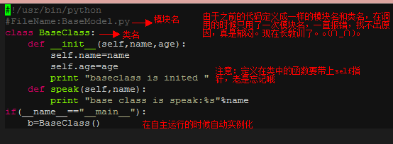
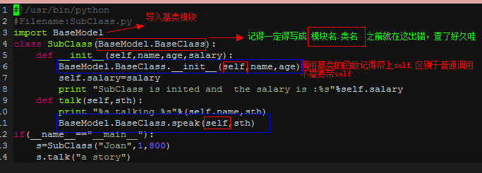
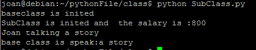
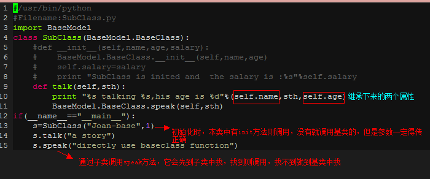
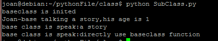

# Python使用问题记录

本文中使用为py3.5

## python开发

### `__init__.py`

`__init__.py` 文件的作用是将文件夹变为一个Python模块,Python 中的每个模块的包中，都有`__init__.py` 文件。

通常`__init__.py` 文件为空，但是我们还可以为它增加其他的功能。我们在导入一个包时，实际上是导入了它的`__init__.py`文件。这样我们可以在`__init__.py`文件中批量导入我们所需要的模块，而不再需要一个一个的导入。

### classmethod 和 staticmethod的用法

staticmethod() 函数该方法不强制要求传递参数，类可以不用实例化就可以调用该方法 。

```python
class C(object):
    @staticmethod
    def f():
        print('runoob');
 
C.f();          # 静态方法无需实例化
cobj = C()
cobj.f()        # 也可以实例化后调用
```

**classmethod** 修饰符对应的函数不需要实例化，不需要 self 参数，但第一个参数需要是表示自身类的 cls 参数，可以来调用类的属性，类的方法，实例化对象等。

```python
class A(object):
    bar = 1
    def func1(self):  
        print ('foo') 
    @classmethod
    def func2(cls):
        print ('func2')
        print (cls.bar)
        cls().func1()   # 调用 foo 方法
 
A.func2()               # 不需要实例化
```

## 注意事项

### 条件运算

在条件运算时，&和|比>,<运算等级高，要注意加括号以保证结果正确。

### 输出中插入数字

以%开头，`.3f`表示小数点后保持三位。f表示为浮点型（float）。当有多个输出时，用`()`，输出的数字前用%表示开始。

```python
print('a is %.3f,b is %.3f'%(0.2,0.5))
-->a is 0.200,b is 0.500
```

### 变量赋值

`_`可以进行赋值

```python
#给多个变量赋值
data=['alex',84,[1900,3,38]]
name,age,birth=data
print(name)
print(age)
print(birth)
#
msg='hello'
a,b,c,d,e=msg
print(a,b,c,d,e)


msg='hello'
a,_,_,_,b=msg
print(a)
print(b)
#只给第一个和最后一个变量赋值
a,*_,b=msg
print(a,b)
```

### 空值

```python
None==None
-->True
#在df的列中得到空值得真值表
df.col1==None
#无法得到该列为空的真值表，需要使用isnull()
df.col1.isnull()

from numpy import NaN
NaN==NaN
-->False
```

### isinstance

```python
#通过内置函数isinstance进行判断变量是否为某个类型，是则返回True
isinstance(val,type)
a = 4
isinstance (a,int)
-->True
```

### if  not  列表

是判断列表是否为空，如果为空，则返回True，否则返回False

```python
if  not ['a','b','c']:
    print(1)
else:
    print(2)
-->2
```

### for技巧

python中的for循环可通过内嵌来用于对列表，字典的循环赋值，也可用于其他数据类型的赋值。通过对for的使用，可以简化代码。

```python
#列表赋值
l=[i for i in range(2)]

#字典赋值
d={i:l[i] for i in l}

#对np.array赋值
np.array([inputs[batch_id][length_id] for batch_id in range(batch_size)], dtype=np.int32)
```

### if技巧

python中if的几种简便写法

```python
#常规写法
if a>b:
    c = a
else:
    c = b
#表达式写法
c = a if a>b else b 

#列表写法
#利用了列表的索引，True为1，False为0，从列表中取值
c=[b,a][a>b]

#逻辑写法，即使下面的逻辑控制的综合应用
#利用了or如果第一项为真不会判断第二项的特性，如果a>b为True，则a为True，or操作结束。如果a>b为False，则or左边为False，得到b
c = (a>b and a or b)
```

### 逻辑控制

关于python中的逻辑控制。

下面例子中的a和b不一定为bool型，可以是数字和字符串

#### and

```python
#在使用and时，返回结果有以下几种情况
a and b
'''
当a和b均为true时，返回b
当a和b存在False时，返回False
'''
```

#### or

```python
#在使用or时，返回结果有以下几种情况
a or b
'''
当a为True时，直接返回a
当a为False时，b为True则返回b。
a和b均为False时，返回False
'''
```

### 全局变量和局部变量

函数内部的变量名如果第一次出现，且出现在`=`前面，即被视为定义一个局部变量。 

```python
num = 100
def func():
    num = 123
    print(num)

func()
->123

#说明函数中定义的num是一个局部变量，会将全局变量覆盖。再例如：

num = 100
def func():
    num += 100
    print(num)

func()
->UnboundLocalError: local variable 'num' referenced before assignment
```

### 多变量命名

使用locals()或者globals()，这两个函数提供了基于字典的访问局部和全局变量的方式。key为变量名，value为对应的变量值。

```python
for i in range(10):
    locals()['name%s' % i],c = i,10 
    #通过字典的方式生成命名为name1，name2，。。。，name9的变量
    
for i in ['a','b']:
    locals()[i] =[1,23,3] 
```

### 多条件执行

当需要多个条件判断来执行时，可以使用字典格式，条件为key,动作为value。下面是根据条件来选用不同函数的例子。

```python
class test():

    def __init__(self,fun='a'):
        self.fun=fun
        
    def _a(self):
        print('a')
    def _b(self):
        print('b')
        
    def c(self):
        #得到条件字典
        fun_list={'a':self._a,'b':self._b}
        #根据输入来选择需要执行的函数
        fun_list[self.fun]()
        
t=test(fun='b')
t.c()
```

### @的用法

'@'符号用作函数修饰符，即将被修饰的函数作为参数，返回修饰后的同名函数或其他可调用的东西。修饰符必须出现在函数定义前一行，不允许和函数定义在同一行。也就是说@A def f(): 是非法的。 只可以在模块或类定义层内对函数进行修饰，不允许修修饰一个类。

```python
#在addspam中先定义了new(*args)函数，在return中调用new函数，在new中调用fn函数
def addspam(fn):
    def new(*args):
        print("spam,spam,spam")
        return fn(*args)
    return new
@addspam
def useful(a,b):
    print(a**2+b**2)
#调用useful(4,3)时会将useful当作参数调用addspam(useful(4,3))
useful(4,3)
-->
spam,spam,spam
25
```

@lazy_property

在方法前加@property可以将方法直接当成属性访问。但会在每次执行c.area时都会调用一次，现在可以使用@lazy_property，使只在初始化时调用一次。

```python
class Circle(object): 
  def __init__(self, radius): 
    self.radius = radius 
  
  @property
  def area(self): 
    return 3.14 * self.radius ** 2
  
c = Circle(4) 
print(c.radius) 
print(c.area) 

def lazy_property(func):
    attr_name = "_lazy_" + func.__name__
 
    @property
    def _lazy_property(self):
        if not hasattr(self, attr_name):
            setattr(self, attr_name, func(self))
        return getattr(self, attr_name)
 
    return _lazy_property
```

### assert

断言，Python的assert是用来检查一个条件，如果它为真，就不做任何事。如果它为假，则会抛出AssertError并且包含错误信息。

```python
x=5
assert x > 0, "x is not zero or negative" 
assert x%2 == 0, "x is not an even number"


AssertionError                            Traceback (most recent call last)
<ipython-input-10-394dd573a39e> in <module>()
      1 x=5
      2 assert x > 0, "x is not zero or negative"
----> 3 assert x%2 == 0, "x is not an even number"

AssertionError: x is not an even number

```

### 函数注意事项

1. 函数中的值可以直接用函数外的值而不需要参数传递
2. 以单下划线开头`_fun`，是弱内部使用标识，from M import * 时，将不会导入该对象（python 一切皆对象）。
3. 以双下划线开头的变量名`__fun`，主要用于类内部标识类私有，不能直接访问。模块中使用见上一条。
4. 双下划线开头且双下划线截尾的命名方法尽量不要用，这是标识`__main__`

### 函数的参数

python函数参数定义有四种方法：位置参数，默认参数，可变参数，关键字参数，四种如果要同时使用多种参数，需要按照（位置参数，默认参数，可变参数，关键字参数）顺序定义。

```python
#位置参数
def fun(a,b):
    print(a)
    print(b)
fun(20,30)
->20
->30

#默认参数
def fun(a=10,b=20):
    print(a)
    print(b)
fun()
->10
->20

#可变参数定义需加一个*
#可变参数会将多的参数转变为list，放入的可变参数中
def fun(a,b,*c):
    print(a)
    print(b)
    for i in c:
        print(i)
    print(c)
#c取到的为a，b多余的元素，如果为列表[3,4]，则c中只有一个元素，即列表[3,4]，而不是当前这样，c为一个列表，里面有3,4两个元素
fun(10,20,3,4)
->10
->20
->3
->4
->(3, 4, 5, 6, 7)

#关键字参数，定义需加**
#关键字参数会将参数形成dict对
def fun(a,**kw):
    print(a)
    print(type(kw))
    for i in kw.keys():
        print(i,'  ',kw[i])
fun(10,s=2,c=3)
->10
-><class 'dict'>
->c    3
->s    2
```

### 多函数使用

对于多函数直接用字典或列表循环调用即可。

```python
def a():
    print('a')
def b():
    print('b')
c=[a,b]
for i in c:
    i()
->a
->b
```

### 类的继承

面向对象的编程带来的主要好处之一是代码的**重用**，实现这种重用的方法之一是通过继承机制。继承完全可以理解成类之间的类型和子类型关系。

需要注意的地方：**继承语法**   class 派生类名（**基类名**）：//...   基类名写作括号里，基本类是在类定义的时候，**在元组之中指明的**。这与c#是有区别的。

何时使用继承：假如我需要定义几个类，而类与类之间有一些公共的属性和方法，这时我就可以把相同的属性和方法作为基类的成员，而特殊的方法及属性则在本类中定义，这样只需要继承基类这个动作，就可以访问到基类的属性和方法了，它提高了代码的可扩展性。

任何事情都有利有弊：继承的一个弱点就是，可能特殊的本类又有其他特殊的地方，又会定义一个类，其下也可能再定义类，这样就会造成继承的那条线越来越长，使用继承的话,任何一点小的变化也需要重新定义一个类,很容易引起类的爆炸式增长,产生一大堆有着细微不同的子类. 所以有个“多用组合少用继承”的原则，（我觉得两者一起使用才是最佳吧*^◎^*）

**在python中继承中的一些特点：**

**1：在继承中基类的构造`__init__()`方法不会被自动调用，它需要在其派生类的构造中亲自专门调用。有别于C#**

**2：在调用基类的方法时，需要加上基类的类名前缀，且需要带上self参数变量。区别于在类中调用普通函数时并不需要带上self参数**

**3：Python总是首先查找对应类型的方法，如果它不能在派生类中找到对应的方法，它才开始到基类中逐个查找。（先在本类中查找调用的方法，找不到才去基类中找）。**

如果在继承元组中列了一个以上的类，那么它就被称作“多重继承” 。

实例：定义一个模块，模块里定义了一个基类：



子类：



输出：



 假如在子类中不用__init__()初始化函数，那么子类会继承基类的属性，如：



 输出：



### 小数取整

```python
#向下取整
#向下取整直接用内建的 int() 函数即可：
>>> a = 3.75
>>> int(a)
3
#使用math的floor方法：
>>>math.floor(a)
3

#四舍五入
#对数字进行四舍五入用 round() 函数：
>>> round(3.25); round(4.85)
3.0
5.0

#向上取整
#向上取整需要用到 math 模块中的 ceil() 方法:
>>> import math
>>> math.ceil(3.25)
4.0
```

### int函数

```python
int(x,base)
#将数字转换为10进制的整数
#x 字符串或数字
#base 数字的进制数，当有base参数时，x需要为字符串

>>>int()               # 不传入参数时，得到结果0
0
>>> int(3)
3
>>> int(3.6)
3
>>> int('12',16)        # 如果是带参数base的话，12要以字符串的形式进行输入，12 为 16进制
18
>>> int('0xa',16)  
10  
>>> int('10',8)
8
```

### bin函数

**注意：**返回二进制为字符串格式，且以`'0b'`开头

```python
bin(x)
#返回一个int或long int的二进制表示
#x int或long int

>>>bin(10)
'0b1010'
>>> bin(20)
'0b10100'
```

### type函数

得到变量的类型。

```python
#用来判断是否变量为列表
a=[1,2,3]
if type(a)==list:
    print('ok')
```

### isinstance函数

用来判断变量是不是某种类型

```python
a=[1,2,3]
if isinstance(a,list):
    print('ok')

```

### zip函数

zip函数接受任意多个（包括0个和1个）序列作为参数，返回一个tuple列表。

```python
a=[1,2,3,4,5]
b=[6,7,8,9]
print(list(zip(a,b)))
-->
[(1, 6), (2, 7), (3, 8), (4, 9)]
```

### id函数

id方法的返回值就是对象的内存地址。

### repr函数

可显示换行符。

str出来的值是给人看的字符串,*repr*出来的值是给机器看的

```python
a='asdwed\n'
print(a)
->123sad

print(repr(a))
->'123sad\n'
```

### enumerate

- 对于一个可迭代的（iterable）/可遍历的对象（如列表、字符串），enumerate将其组成一个索引序列，利用它可以同时获得索引和值
- enumerate多用于在for循环中得到计数

```python
enumerate(iter,i)
#iter为一个可迭代或遍历的对象
#i 为起始索引
list1 = ["这", "是", "一个", "测试"]
for index, item in enumerate(list1, 1):
    print(index, item)
->
1 这
2 是
3 一个
4 测试
```

### sorted

```python
#python内置的sorted函数可用于dict和list的排序，特别是对于[('a',3),('b',2)]这种类型的列表十分有用
new_list1=sorted(list1, key=lambda x:x[1],  reverse = True)
#排列结束后需要进行赋值
#list1为所需排列的列表
#key为排列所用的值
#reverse 是否从大到小排列
```

### map

`map()`函数接收两个参数，一个是函数，一个是`Iterable`，`map`将传入的函数依次作用到序列的每个元素，并把结果作为新的`Iterator`返回。在python3中map需要list(map(fun,iter))。

举例说明，比如我们有一个函数`f(x)=x^2`，要把这个函数作用在一个list `[1, 2, 3, 4, 5, 6, 7, 8, 9]`上，就可以用`map()`实现如下：

```python
def f(x):
     return x * x
r = map(f, [1, 2, 3, 4, 5, 6, 7, 8, 9])
list(r)
[1, 4, 9, 16, 25, 36, 49, 64, 81]

#还可用于df中，df的一行为一个iter
df=pd.DataFrame({'a':[1,2,3,4,5,6,7,8,9],'b':[1,1,1,1,1,1,1,1,1],'c':[0.1,0.2,0.3,0.4,0.5,0.6,0.7,0.8,0.9]})
def add(x,y,z):
    return x+y+z
df['sum']=list(map(lambda x,y,z:add(x,y,z),df['a'],df['b'],df['c']))
```

### reduce

`reduce`在python3中已被封装到`functools`中，如果在python3中使用需要从`functools`中导入。

`reduce`把一个函数作用在一个序列`[x1, x2, x3, ...]`上，这个函数必须接收两个参数，`reduce`把结果继续和序列的下一个元素做累积计算，其效果就是：

```python
from functools import reduce
reduce(f, [x1, x2, x3, x4]) = f(f(f(x1, x2), x3), x4)
```

### yield使用

用于函数中，将函数变成生成器。保存的是函数的状态，每次在当前状态上迭代。

```python
def feb(max):
    n, a, b = 0, 0, 1
    while n<max:
        yield b
        a, b = b, a + b
        n = n + 1
for i in feb(10):
    print(i)
```

### 错误处理

当代码出错时，为了不影响代码运行。可以使用`try...except...finally...`的处理机制。当我们认为某些代码可能会出错时，就可以用`try`来运行这段代码，如果执行出错，则后续代码不会继续执行，而是直接跳转至错误处理代码，即`except`语句块，执行完`except`后，如果有`finally`语句块，则执行`finally`语句块，至此，执行完毕。

```python
try:
    print('try...')
    r = 10 / 0
    print('result:', r)
except ZeroDivisionError as e:
    print('except:', e)
finally:
    print('finally...')
print('END')

try...
except: division by zero
finally...
END
```

从输出可以看到，当错误发生时，后续语句`print('result:', r)`不会被执行，`except`由于捕获到`ZeroDivisionError`，因此被执行。最后，`finally`语句被执行。然后，程序继续按照流程往下走。

**注意：**

1. `except` 后接的是错误代码，只有当出现和`except`后面错误代码一致的错误，才会执行`except`下的语句块，如果没有对应错误编码的`except`则会在执行完`finally`后报错。
2. 当`except`后没有错误编码，则所有错误都会捕获，执行`except`下的语句块。不建议使用此方法，会导致未知的错误不被发现，积累到后面使得问题难以追踪。仅可作为权宜之计。
3. 在使用`except`时需要注意的是，它不但捕获该类型的错误，还把其子类也“一网打尽”。比如：当`ValueErroe`在第一个`except`,`UnicodeError`在第二个`except`时，第二个`except`永远也捕获不到`UnicodeError`，因为`UnicodeError`是`ValueError`的子类，如果有，也被第一个`except`给捕获了。

### 输出显示

python输出的两种方式，一种输出会有换行，显示所有的输出结果，另一种没有换行，只显示当前的输出结果。

```python
#方法一
#常用的print()输出
for i in range(5):
    print(i)
->
0
1
2
3
4
#方法二
#利用sys进行输出
import sys
for i in range(5):
    sys.stdout.write('\r')
    info = "{}" .format(i)
    sys.stdout.write(info)
    sys.stdout.flush()
->
4
```

## 冷门包使用

### 简繁转换

[opencc](https://github.com/BYVoid/OpenCC#installation-%E5%AE%89%E8%A3%9D) 功能完善，但需要编译使用。pypi中的python包均太旧，不支持py3.

[hanziconv](https://github.com/berniey/hanziconv) 功能简单，但可以直接pip安装。

```python
>>> from hanziconv import HanziConv
>>> print(HanziConv.toSimplified('繁簡轉換器'))
繁简转换器
>>> print(HanziConv.toTraditional('繁简转换器'))
繁簡轉換器
>>> HanziConv.same('繁簡轉換器', '繁简转换器')
True
```

## 数据类型

### list(列表)

列表是最常用的Python数据类型，它可以作为一个方括号内的逗号分隔值出现。

#### 创建列表

```python
list1 = ['physics', 'chemistry', 1997, 2000];
list2 = [1, 2, 3, 4, 5 ];
list3 = ["a", "b", "c", "d"];
```

与字符串的索引一样，列表索引从0开始。列表可以进行截取、组合等。

#### 访问列表中的值

使用下标索引来访问列表中的值，同样你也可以使用方括号的形式截取字符，如下所示：

```python
list1 = ['physics', 'chemistry', 1997, 2000];
list2 = [1, 2, 3, 4, 5, 6, 7 ];

list1[0]
->physics

list2[1:5]
->[2, 3, 4, 5]
```

#### Python列表截取

Python 的列表截取实例如下：

```python
L = ['Google', 'Runoob', 'Taobao']
L[2]
->'Taobao'
L[-2]
->'Runoob'
L[1:]
->['Runoob', 'Taobao']
```

描述：

| Python 表达式 | 结果                   | 描述           |
| ---------- | -------------------- | ------------ |
| L[2]       | 'Taobao'             | 读取列表中第三个元素   |
| L[-2]      | 'Runoob'             | 读取列表中倒数第二个元素 |
| L[1:]      | ['Runoob', 'Taobao'] | 从第二个元素开始截取列表 |

#### 数据添加

有append和extend两种方法添加数据，均是在list末尾添加数据。

不同之处为：

lsit.append(list1)是在list中新增元素，即使是列表list1也会被当成子元素放入list中。

list.extend(list1)是做list融合，将list1中的元素当做子元素放入list中。

```python
#append
a=[]
b=[1,2,3]
c=[[4],[5],[6]]
a.append(b)
a.append(c)
a
->[[1, 2, 3], [[4], [5], [6]]]

#extend
a=[]
b=[1,2,3]
c=[[4],[5],[6]]
a.extend(b)
a.extend(c)
a
->[1, 2, 3, [4], [5], [6]]
```

#### 数据更新

使用索引对列表进行更新。

```python
#!/usr/bin/python

list = ['physics', 'chemistry', 1997, 2000];

list[2] = 2001;
list
->['physics', 'chemistry', 2001, 2000]
```

#### 删除列表元素

有del和list.remove两种方法进行删除元素。

```python
#方法一，使用del删除元素，通过索引定位
list1 = ['physics', 'chemistry', 1997, 2000];
del list1[2];
->['physics', 'chemistry', 2000]

#方法二，使用remove(obj)移除列表中obj(某个值)的第一个匹配项.
aList = [123, 'xyz', 'zara', 'abc', 'xyz'];

aList.remove('xyz');
aList
->[123, 'zara', 'abc', 'xyz']
```

#### Python列表脚本操作符

列表对 + 和 * 的操作符与字符串相似。+ 号用于组合列表，* 号用于重复列表。

如下所示：

| Python 表达式                   | 结果                           | 描述         |
| ---------------------------- | ---------------------------- | ---------- |
| len([1, 2, 3])               | 3                            | 长度         |
| [1, 2, 3] + [4, 5, 6]        | [1, 2, 3, 4, 5, 6]           | 组合         |
| ['Hi!'] * 4                  | ['Hi!', 'Hi!', 'Hi!', 'Hi!'] | 重复         |
| 3 in [1, 2, 3]               | True                         | 元素是否存在于列表中 |
| for x in [1, 2, 3]: print x, | 1 2 3                        | 迭代         |

#### Python列表函数&方法

Python包含以下函数:

| 序号   | 函数                                       |
| ---- | ---------------------------------------- |
| 1    | [cmp(list1, list2)](http://www.runoob.com/python/att-list-cmp.html)比较两个列表的元素 |
| 2    | [len(list)](http://www.runoob.com/python/att-list-len.html)列表元素个数 |
| 3    | [max(list)](http://www.runoob.com/python/att-list-max.html)返回列表元素最大值 |
| 4    | [min(list)](http://www.runoob.com/python/att-list-min.html)返回列表元素最小值 |
| 5    | [list(seq)](http://www.runoob.com/python/att-list-list.html)将元组转换为列表 |

Python包含以下方法:

| 序号   | 方法                                       |
| ---- | ---------------------------------------- |
| 1    | [list.append(obj)](http://www.runoob.com/python/att-list-append.html)在列表末尾添加新的对象 |
| 2    | [list.count(obj)](http://www.runoob.com/python/att-list-count.html)统计某个元素在列表中出现的次数 |
| 3    | [list.extend(seq)](http://www.runoob.com/python/att-list-extend.html)在列表末尾一次性追加另一个序列中的多个值（用新列表扩展原来的列表） |
| 4    | [list.index(obj)](http://www.runoob.com/python/att-list-index.html)从列表中找出某个值第一个匹配项的索引位置 |
| 5    | [list.insert(index, obj)](http://www.runoob.com/python/att-list-insert.html)将对象插入列表 |
| 6    | [list.pop(obj=list[-1\])](http://www.runoob.com/python/att-list-pop.html)移除列表中的一个元素（默认最后一个元素），并且返回该元素的值 |
| 7    | [list.remove(obj)](http://www.runoob.com/python/att-list-remove.html)移除列表中某个值的第一个匹配项 |
| 8    | [list.reverse()](http://www.runoob.com/python/att-list-reverse.html)反向列表中元素 |
| 9    | [list.sort([func\])](http://www.runoob.com/python/att-list-sort.html)对原列表进行排序 |

### set(集合)

#### 创建集合

可以从dict,list,tuple来创建集合

```python
#从tuple来创建
L = [('Jonh',18), ('Nancy',19)]  
T = tuple(L)
set(T)
->{('Jonh', 18), ('Nancy', 19)}

#从list来创建
a=['白云山','坐落','在']
set(a)


#从dict来创建
d1={'a':1,'b':2}
set(d1.items())
->{('a', 1), ('b', 2)}

set(d1)
->{'a', 'b'}
```

#### 判断是否存在元素

```python
#x是否属于集合s，是返回True
x in s

#x是否不属于集合s，不属于返回True
x not in s
```

#### s.update(other)

更新集合s，添加所有出现在other中的元素

等价于`s|=other`

#### s.intersection_update(other)

更新集合s，只保留两者的交集

等价于 `s&=other`

#### s.difference_update(other)

更新集合s。保留s和other的差集

等价于`s-=other`

#### s.symmetric_difference_update(other)

更新集合s.保留s和other并集减去差集

等价于`s^=other`

#### s.add(elm)

添加元素elm到集合s中

#### s.remove(elm)

移除元素elm从集合s中，如果elm在集合s中不存在，报错KeyError

#### s.discard(elm)

如果元素elm在集合s中存在，移除elm

#### s.clear()

移除s中的全部元素

#### s.pop(elm)

删除并返回该集合中的任意元素。 如果该集合为空，则引发KeyError。

#### 常用函数

| 函数                 | 符号用法     | 函数说明                                                     |
| -------------------- | ------------ | ------------------------------------------------------------ |
| isdisjoint(other)    |              | 如果该集合没有与其他元素相同的元素，则返回True。 当且仅当它们的交集是空集时，集合才是不相交的。 |
| issubset(other)      | set <= other | 集合是否是other的子集                                        |
|                      | set<other    | 集合是否是other的真子集                                      |
| issuperset(othe)     | set>=other   | other是否是set的子集                                         |
|                      | set>other    | other是否是set的真子集                                       |
| union                | set\|other   | set和other的并集                                             |
| intersection         | set&other    | set和other的交集                                             |
| difference           | set-other    | set和other的差集                                             |
| symmetric_difference | set^other    | set和other的并集减去差集（(set(a)\|set(b))-(set(a)&set(b))） |
| cop()                |              | 用s的拷贝返回一个新的集合                                    |
|                      |              |                                                              |
|                      |              |                                                              |
|                      |              |                                                              |
|                      |              |                                                              |


- `isdisjoint`(*other*)

  Return `True` if the set has no elements in common with *other*. Sets are disjoint if and only if their intersection is the empty set.

- `issubset`(*other*)

- `set <= other`

  Test whether every element in the set is in *other*.

- `set < other`

  Test whether the set is a proper subset of *other*, that is, `set <= other and set != other`.

- `issuperset`(*other*)

- `set >= other`

  Test whether every element in *other* is in the set.

- `set > other`

  Test whether the set is a proper superset of *other*, that is, `set >= other and set != other`.

- `union`(**others*)

- `set | other | ...`

  Return a new set with elements from the set and all others.

- `intersection`(**others*)

- `set & other & ...`

  Return a new set with elements common to the set and all others.

- `difference`(**others*)

- `set - other - ...`

  Return a new set with elements in the set that are not in the others.

- `symmetric_difference`(*other*)

- `set ^ other`

  Return a new set with elements in either the set or *other* but not both.

- `copy`()

  Return a new set with a shallow copy of *s*.

### dict(字典)

字典是一种以key-value键值对的方式存贮，在提取值是只用使用key即可取得对应value，适用于查询操作，查询复杂度为O(n)。但由于其内部为无序结构，如果需要顺序之类的信息则无能为力。

**注意：**在python3.6中dict已经变为有序字典

#### 创建字典

```python
#方法一，通过大括号进行创建
d1={}
d1={'a':1,'b':2}


#方法二，通过包含键值的元组(tuple/pair)创建
L = [('Jonh',18), ('Nancy',19)]  
T = tuple(L)  
T->(('Jonh', 18), ('Nancy', 19))  
d = dict(T) 

words=[pair('我', 'r'), pair('爱', 'v'), pair('北京', 'ns'), pair('天安门', 'ns')]
dict(words)->{'北京': 'ns', '天安门': 'ns', '我': 'r', '爱': 'v'}


#方法三，通过包含键值的列表创建
L = [('Jonh',18), ('Nancy',19)]  
d = dict(L)  #通过包含键值的列表创建  
d->{'Jonh': 18, 'Nancy': 19}   


#方法四，使用fromkeys创建字典，使用不便，仅供参考。对多个键只能赋同一个value，且无法直接在原字典上增加键值，如果要使其增加，只能通过赋值的方式覆盖原字典
d={3: 'z', 'y': 3}  
L1 = [1,2,3]
d.fromkeys(L1,[['a'],['b'],['c']])
->{1: [['a'], ['b'], ['c']], 2: [['a'], ['b'], ['c']], 3: [['a'], ['b'], ['c']]}
```

#### 添加键值

```python
d={}
#如果对应key存在，则将value替换为新的value。如果key不存在，则添加对应key_value
d['a']=1
```

#### 键值是否存在

```python
d=['a':1,'b':2,'c':3]
'c' in d

'c' in d.keys()
```

#### d.keys()

返回key

#### d.values()

返回value

#### d.copy() 

对字典 d 进行浅复制，返回一个和d有相同键值对的新字典

#### d.items()

将字典 d 中所有键值对以dict_items的形式返回

#### d.clear()

清空字典d

#### del d[x]

删除字典 d 中键为 x 的键值对，若 x 不存在会出现 KeyError

#### d.pop( x )

返回给定键 x 对应的值，并将该键值对从字典中删除

#### d.popitem( )

返回并删除字典 d 中随机的键值对

#### d.setdefault( x, [ , y ] )

返回字典 d 中键 x 对应的值，若键 x 不存在，则返回 y， 并将 x : y 作为键值对添加到字典中，y 的默认值为 None

#### d.update( x )

将字典 x 所有键值对添加到字典 d 中（不重复，重复的键值对用字典 x 中的键值对替代字典 d 中）

## 文件存取

使用`open`方式存取文件，可以设置模式来进行读写限制，'r'为读，'w'为写，'a'为追加，'t'为操作方式为文本，'b'为操作方式为bytes流。对于视频或者图片，只能使用bytes操作。

### 图片和视频

```python
url = 'http://cv4.jikexueyuan.com/10de45bbf83e450ff5e11ff4599d7166/201603202253/cocos2d-x/course_712/01/video/c712b_01_h264_sd_960_540.mp4'
r = requests.get(url)
file_name = str(key)+"_"+str(value)+".mp4"
with open(file_name, "wb") as code:
    code.write(r.content)
```

### txt

```python
#读取txt
#方法一
f=open('test.txt')        
#返回文件对象
line=f.readline()
#读取一行文件
while line:
    print(line)
    line=f.readline()
f.close()
#方法二
line=[line.strip() for line in open('/home/weblogic/DATA/private/shangguanxf/cc_txt1/stopword.txt').readlines()] 
#readlines()为读取全部行的数据
#line.strip()为去除每行后面的'\n'

#方法三
with open(vocab_path, 'rb',encoding='utf-8') as f:
  		#f.read()为读取f文件
    	#splitlines()为按行分割
        words = f.read().splitlines()
         
```

```python
#保存为txt,在win显示需加\r
with open ('/home/weblogic/DATA/private/shangguanxf/txt_anaysis/create/product_p.txt','wt') as file2:
    for key in product_p:
        file2.writelines('%s,%s\n' % (key, product_p[key]))   

```

### csv

```python
#读取csv
#按行读取
f=open('/home/weblogic/DATA/private/shangguanxf/cc_txt1/product.txt',encoding="gb18030").readlines()
#按照分隔符进行分割
line=[line.split(',') for line in f]
```


```python    
#保存为csv
with codecs.open(os.path.join("/home/weblogic/DATA/private/shangguanxf/cc_bigdata/create/工单机构分布/画图/",filespath),"w",'gb18030') as datacsv:
            #读取csv文件，返回的是迭代类型
            c1 = csv.writer(datacsv,dialect = ("excel"))
            for one in out.items():
                c1.writerow([one[0],one[1]])
            for two in tmp.items():
                c1.writerow([two[0],two[1]])
```

```python
#csv在原有文件后面追加，即需要设置模式为'a'
with open('D:/Program Files (x86)/Tencent/WeChat/WeChat Files/s_g_x_f/Files/data2007.csv','a') as f:
        for i in city:
            f.writelines('%s,%s,%s,%s\n' % (i,data[i][0],data[i][1],data[i][2]))
```

### json

```python
import json
#生成json数据
data = {
'name' : 'ACME',
'shares' : 100,
'price' : 542.23
}
 
json_str = json.dumps(data)
#将字符串转回python数据结构
data1=json.loads(json_str)

#写json文件
with open('data.json', 'w') as f:
    json.dump(data,f)
#读json文件
with open('data.json', 'r') as f:
    data = json.load(f)
```

### xml

xml格式简单介绍

```xml
<?xml version="1.0" ?> 
- <data>
- <country name="Singapore">#name为country的属性，country为标签(tag)
  <rank>4</rank> #4为'rank'标签的text
  <year>2011</year> 
  <gdppc>59900</gdppc> 
  <neighbor name="Malaysia" direction="N" /> 
  </country>
- <country name="Panama">
  <rank>68</rank> 
  <year>2011</year> 
  <gdppc>13600</gdppc> 
  <neighbor name="Costa Rica" direction="W" /> 
  <neighbor name="Colombia" direction="E" /> 
  </country>
  </data>
```

xml读取有三种方法SAX，DOM，以及ElementTree。因DOM需要将XML数据映射到内存中的树，一是比较慢，二是比较耗内存，而SAX流式读取XML文件，比较快，占用内存少，但需要用户实现回调函数（handler）。ElementTree相对DOM速度要快，api接口也相对友善，因此这里只介绍ElementTree。

**注意：**

xml.etree.ElementTree模块不能防止恶意构造的数据。 如果您需要解析不受信任或未经身份验证的数据，请参阅[XML漏洞](https://docs.python.org/3.5/library/xml.html#xml-vulnerabilities)。

```python
import xml.etree.ElementTree as ET
#读取xml文件
tree = ET.parse('country_data.xml')
root = tree.getroot()
#读取xml格式的文本
root = ET.fromstring(country_data_as_string)
#使用下标访问
root[0][1].text
-->'2011'
#一级下标为country,二级下标为country中包含的标签。此例中[0][1]指第一个country,中的year，text为该标签的内容

#for循环遍历输出
for child in root: 
    #到country一级
    print(child.tag, "---", child.attrib) 
    for i in child:
        #到rank，year...这一级
        print(i.text)
        #输出文本，由于neighbor没有text会输出None

#使用iter直接遍历二级标签
for neighbor in root.iter('neighbor'):
...     print(neighbor.attrib)
#for neighbor in root.iter('yaer'):
#...     print(neighbor.text)

#通过搜索标签来输出，当为一级标签时直接搜索标签，当为二级标签时，搜索为路径'country/year'
for i in root.findall('country/year'):
    #find为搜索到的第一个元素，findall为全部元素
    print(i.text)

#写出xml文件
tree.write(out_path, encoding="utf-8",xml_declaration=True,method="xml")
#out_path 输出地址
#encoding 编码，默认为"us-ascii"
#xml_declaration 是否将xml声明添加到文件中，默认为None。True为始终添加，False为从添加，None为不是这三种编码时添加（US-ASCII or UTF-8 or Unicode）
#method设置输出格式，可选'xml','html','txt',默认为'xml'
```

### yaml

在提取文本上有时直接按照txt文本读取通过正则进行匹配搜索会更有效率。

```python
#读取yaml
import yaml
with open('/tpdata/DATA/private/shangguanxf/cc_txt3/太平保险文本格式确认/879001010321183.yaml','r') as file:
    stream=file.read()
data=yaml.load(stream)
```

```python
#保存yaml
import yaml
with open('/tpdata/DATA/private/shangguanxf/cc_txt3/太平保险文本格式确认/879001010321183.yaml','w') as file:
    #将data保存到stream文件中
	yaml.dump(data,stream)
```

### pdf

需要使用命令`pip install pdfminer.six`安装包。

[官网](https://euske.github.io/pdfminer/index.html)

```python
from pdfminer.pdfinterp import PDFResourceManager, PDFPageInterpreter
from pdfminer.converter import TextConverter
from pdfminer.pdfdocument import PDFDocument
from pdfminer.layout import LAParams
from pdfminer.pdfpage import PDFPage
from io import StringIO

def extract_pdf_content(pdf):
    rsrcmgr = PDFResourceManager()
    codec = 'utf-8'
    outfp = StringIO()
    laparams = LAParams()
    device = TextConverter(rsrcmgr=rsrcmgr, outfp=outfp, codec=codec, laparams=laparams)
    if not doc.is_extractable:
        raise PDFTextExtractionNotAllowed
    with open(pdf, 'rb') as fp:
        interpreter = PDFPageInterpreter(rsrcmgr, device)
        #检测是否允许文本提取，不允许则跳过
        parser = PDFParser(fp)
        # Create a PDF document object that stores the document structure.
        # Supply the password for initialization.
        document = PDFDocument(parser, password)
        # Check if the document allows text extraction. If not, abort.
        if not document.is_extractable:
            #raise PDFTextExtractionNotAllowed
            mystr=''
            is_succeed=0#失败返回0
        else:    
            password = ""
            maxpages = 0
            caching = True
            pagenos=set()
            for page in PDFPage.get_pages(fp, pagenos, maxpages=maxpages, password=password,caching=caching, check_extractable=True):
                interpreter.process_page(page)
            mystr = outfp.getvalue()
            is_succeed=1#读取成功返回1
            device.close()
            outfp.close()
    return mystr,is_succeed

```

## 文件压缩

gz： 即gzip。通常仅仅能压缩一个文件。与tar结合起来就能够实现先打包，再压缩。

xz:	xz是一种压缩文件格式，采用LZMA SDK压缩，目标文件较[gzip](https://baike.baidu.com/item/gzip/4487553)压缩文件(.gz或·tgz)小30%，较·bz2小15%。

tar： linux系统下的打包工具。仅仅打包。不压缩

tgz：即tar.gz。先用tar打包，然后再用gz压缩得到的文件

zip： 不同于gzip。尽管使用相似的算法，能够打包压缩多个文件。只是分别压缩文件。压缩率低于tar。

rar：打包压缩文件。最初用于DOS，基于window操作系统。压缩率比zip高，但速度慢。随机訪问的速度也慢。

### gz/xz/bz2/tar/tgz

`tarfile`支持 [`gzip`](https://docs.python.org/3.6/library/gzip.html#module-gzip), [`bz2`](https://docs.python.org/3.6/library/bz2.html#module-bz2) and [`lzma`](https://docs.python.org/3.6/library/lzma.html#module-lzma)（即后缀为.xz的文件）这三种格式的压缩读写。

[官方文档](https://docs.python.org/3.6/library/tarfile.html#module-tarfile)

`tarfile.open`(*name=None*, *mode='r'*, *fileobj=None*, *bufsize=10240*, **\*kwargs*)

```python
tarfile.open(name=None, mode='r', fileobj=None, bufsize=10240, **kwargs)
#name 文件路径
#mode 执行的模式
#fileobj 如果指定了fileobj，那么它将用作以二进制模式打开的名称文件对象的替代方案。 它应该在位置0。
#bufsize 每次读取的块大小，单位为bytes
```

| mode            | action                                                       |
| --------------- | ------------------------------------------------------------ |
| `'r' or 'r:*'`  | Open for reading with transparent compression (recommended). |
| `'r:'`          | 无压缩打开                                                   |
| `'r:gz'`        | 用gzip的方式解压缩                                           |
| `'r:bz2'`       | 用bzip2的方式解压缩                                          |
| `'r:xz'`        | 用lzma的方式解压缩                                           |
| `'x'` or `'x:'` | 创建一个tarfile而不压缩。 引发FileExistsError异常（如果它已存在）。 |
| `'x:gz'`        | 创建一个tarfile使用gzip压缩。 引发FileExistsError异常（如果它已存在）。 |
| `'x:bz2'`       | 创建一个tarfile使用bzip2压缩。 引发FileExistsError异常（如果它已存在）。 |
| `'x:xz'`        | 创建一个tarfile使用lzma压缩。 引发FileExistsError异常（如果它已存在）。 |
| `'a' or 'a:'`   | Open for appending with no compression. The file is created if it does not exist. |
| `'w' or 'w:'`   | 创建一个tarfile而不压缩。                                    |
| `'w:gz'`        | 创建一个tarfile使用gzip压缩。                                |
| `'w:bz2'`       | 创建一个tarfile使用bzip2压缩。                               |
| `'w:xz'`        | 创建一个tarfile使用lzma压缩。                                |

**注意：**`w`和`x`的区别就是当文件已存在时是否会报错。`x`会报错，`w`会直接覆盖。

下面的模式返回的是tar块流

| Mode      | Action                                        |
| --------- | --------------------------------------------- |
| `'r|*'`   | 透明压缩打开一个tar块流供阅读。               |
| `'r|'`    | 无压缩打开一个tar块流                         |
| `'r|gz'`  | Open a gzip compressed *stream* for reading.  |
| `'r|bz2'` | Open a bzip2 compressed *stream* for reading. |
| `'r|xz'`  | Open an lzma compressed *stream* for reading. |
| `'w|'`    | Open an uncompressed *stream* for writing.    |
| `'w|gz'`  | Open a gzip compressed *stream* for writing.  |
| `'w|bz2'` | Open a bzip2 compressed *stream* for writing. |
| `'w|xz'`  | Open an lzma compressed *stream* for writing. |

#### 解压文件

解压文件常用有两种方法`extract`,`extractall`

##### extractall()

解压所有文件到指定目录

```python
TarFile.extractall(path=".", members=None, *, numeric_owner=False)
#path 解压后的路径，默认为当前工作路径
#members 解压的文件列表，可通过getmembers()得到

import tarfile
tar = tarfile.open("/tpdata/CC/科大讯飞文本/yl204/yl204_2017051416.tgz")
#将所有文件都解压到指定路径
tar.extractall('/tpdata/CC/科大讯飞文本/yl204/')
tar.close()

#解压缩文件列表里的前十个文件
import tarfile
tar = tarfile.open("/tpdata/CC/科大讯飞文本/yl204/yl204_2017051416.tgz")
tar.extractall('/tpdata/CC/科大讯飞文本/yl204/',members=tar.getmembers()[0:10])
tar.close()
```

##### extract()

解压指定文件到指定目录

```python
TarFile.extract(member, path="", set_attrs=True, *, numeric_owner=False)
#member 需要解压的文件，输入文件在压缩包里路径地址（例如：'home/iflytek/out/yl204_2017051416/1600004002800217.txt'）
#path 解压后的文件存放路径

#解压指定的文件
tar = tarfile.open("/tpdata/CC/科大讯飞文本/yl204/yl204_2017051416.tgz")
tar.extract('home/iflytek/out/yl204_2017051416/1600004002800217.txt','/tpdata/CC/科大讯飞文本/yl204/')
tar.close()
```

#### 压缩文件

通过`add`函数将待压缩的文件放入列表中

```python
TarFile.add(name, arcname=None, recursive=True, exclude=None, *, filter=None)
#name 待压缩文件的名称，需要包含路径
#arcname 将待压缩的文件重命名
#recursive 是否迭代的读入数据
#exclude 是否排除，输入为一个函数名，函数需要输入为文件名，输出为True（不加该文件加入压缩列表），输出为False（将该文件加入压缩列表）
#filter 是一个对tarinfo进行操作的函数，输入为tarinfo，如果返回为None，则该文件不加入压缩列表

#最简单的压缩
tar=tarfile.open('/tpdata/DATA/private/shangguanxf/test.tar','w')
for name in ['/tpdata/DATA/private/shangguanxf/poems.txt']:
    tar.add(name)
tar.close()

#利用exclude参数对输入文件做筛选
def f(name):
    if name.find('.py')>-1:
        return True
    else:
        return False
tar=tarfile.open('/tpdata/DATA/private/shangguanxf/test.tar','w')
for name in ['/tpdata/DATA/private/shangguanxf/poems.txt']:
    tar.add(name,'t1.txt',exclude=f)
tar.close()

#利用filter对文件做筛选
def reset(tarinfo):
    tarinfo.uid = tarinfo.gid = 0
    tarinfo.uname = tarinfo.gname = "root"
    return tarinfo
tar = tarfile.open("sample.tar.gz", "w:gz")
tar.add("foo", filter=reset)
tar.close()
```

#### 其他常用函数

##### TarInfo.isfile()

返回True如果`Tarinfo` 对象是一个规则的文件。

##### TarInfo.isreg()

等同于 [`isfile()`](https://docs.python.org/3.6/library/tarfile.html#tarfile.TarInfo.isfile)

### zip

```python
import zipfile
def un_zip(file_name):
    """unzip zip file"""
    zip_file = zipfile.ZipFile(file_name)
    if os.path.isdir(file_name + "_files"):
        pass
    else:
        os.mkdir(file_name + "_files")
    for names in zip_file.namelist():
        zip_file.extract(names,file_name + "_files/")
    zip_file.close()
```

### rar

```python
import rarfile
def un_rar(file_name):
    """unrar zip file"""
    rar = rarfile.RarFile(file_name)
    if os.path.isdir(file_name + "_files"):
        pass
    else:
        os.mkdir(file_name + "_files")
    os.chdir(file_name + "_files")
    rar.extractall()
    rar.close()
```

## str

在字符串前面加u，`u'中国'`表示unicode编码，可以直接使用encode进行编码转换。字符串前面加b，`b'\xe4\xb8\xad\xe5\x9b\xbd'`表示byte字符串，可直接根据编码格式进行解码。

### 转义字符

| 转义字符    | 描述            | 转义字符   | 描述                        |
| ------- | ------------- | ------ | ------------------------- |
| \(在行尾时) | 续行符           | \other | 其它的字符以普通格式输出              |
| \\      | 反斜杠符号         | \xyy   | 十六进制数，yy代表的字符，例如：\x0a代表换行 |
| \'      | 单引号           | \oyy   | 八进制数，yy代表的字符，例如：\o12代表换行  |
| \"      | 双引号           | \f     | 换页                        |
| \a      | 响铃            | \r     | 回车                        |
| \b      | 退格(Backspace) | \t     | 横向制表符                     |
| \e      | 转义            | \v     | 纵向制表符                     |
| \000    | 空             | \n     | 换行                        |

### 字符串运算

下列实例中a='Hello',b='Python'

| 操作符    | 描述                                       | 实例                   |
| ------ | ---------------------------------------- | :------------------- |
| +      | 字符串连接                                    | a+b>>>'HelloPython'  |
| *      | 重复输出字符串                                  | a * 2>>>'HelloHello' |
| []     | 通过索引获取字符串中字符                             | a[1]>>>'e'           |
| [ : ]  | 截取字符串中的一部分                               | a[1:4]>>>'ell'       |
| in     | 成员运算符 - 如果字符串中包含给定的字符返回 True             | "H" in a>>>True      |
| not in | 成员运算符 - 如果字符串中不包含给定的字符返回 True            | "M" not in a>>>True  |
| r/R    | 原始字符串 - 原始字符串：所有的字符串都是直接按照字面的意思来使用，不会进行转义字符操作。 原始字符串除在字符串的第一个引号前加上字母"r"（可以大小写）以外，与普通字符串有着几乎完全相同的语法。 | print(r'\n')>>>  \n  |

```python
#r操作符实例
print('a\nb')
-->
a
b
print(r'a\nb')
-->
a\nb
```

### 字符串编码

python3中，我们使用decode()和encode()来进行解码和编码，python使用的中间码为unicode编码，所有字符串读到str类型后都会转换成unicode编码。在python中进行编码转换也需要先转换到unicode再转换到目标编码。字符串编码常用类型：`utf-8,gb2312,cp936,gbk,gb18030,ascii`等。

​     decode              encode

bytes ------> str(unicode)------>bytes

```python
u = '中文' #指定字符串类型对象u
str = u.encode('gb2312') #以gb2312编码对u进行编码，获得bytes类型对象str
u1 = str.decode('gb2312')#以gb2312编码对字符串str进行解码，获得字符串类型对象u1
u2 = str.decode('utf-8')#如果以utf-8的编码对str进行解码得到的结果，将无法还原原来的字符串内容
```

我们读取文件时，要对python读取文件的编码方式进行设定，如果读取的编码和保存文件时的编码不一致，会导致无法读取文件。方式如下：

```python
f = open('test.txt','r')
s = f.read() #读取文件内容,如果是不识别的encoding格式（识别的encoding类型跟使用的系统有关），这里将读取失败
'''假设文件保存时以gb2312编码保存'''
u = s.decode('gb2312') #以文件保存格式对内容进行解码，获得unicode字符串
'''下面我们就可以对内容进行各种编码的转换了'''
str = u.encode('utf-8')#转换为utf-8编码的字符串str
str1 = u.encode('gbk')#转换为gbk编码的字符串str1
str1 = u.encode('utf-16')#转换为utf-16编码的字符串str1
```

python给我们提供了一个包codecs进行文件的读取，这个包中的open()函数可以指定编码的类型：

```python
import codecs
f = codecs.open('text.text','r+',encoding='utf-8')#必须事先知道文件的编码格式，这里文件编码是使用的utf-8
content = f.read()#如果open时使用的encoding和文件本身的encoding不一致的话，那么这里将将会产生错误
f.write('你想要写入的信息')
f.close()
```

#### [标准编码表](https://docs.python.org/3/library/codecs.html#standard-encodings)

#### [python特有编码](https://docs.python.org/3/library/codecs.html#Python Specific Encodings)

python特有编码提供了对字节编码和类似于Unicode文本编码的类似字节的对象进行解码。

### 字符串格式化

**注意：**格式化操作符辅助指令写在字符串格式化符号前面。

```python
#示例
#保留两位小数的浮点数
print("My name is %s and weight is %.2f kg!" % ('Zara', 98.2) )
-->My name is Zara and weight is 98.20 kg!
```

字符串格式化符号。

| 符   号 | 描述                 |
| ----- | ------------------ |
| %c    | 格式化字符及其ASCII码      |
| %s    | 格式化字符串             |
| %d    | 格式化整数              |
| %u    | 格式化无符号整型           |
| %o    | 格式化无符号八进制数         |
| %x    | 格式化无符号十六进制数        |
| %X    | 格式化无符号十六进制数（大写）    |
| %f    | 格式化浮点数字，可指定小数点后的精度 |
| %e    | 用科学计数法格式化浮点数       |
| %E    | 作用同%e，用科学计数法格式化浮点数 |
| %g    | %f和%e的简写           |
| %G    | %f 和 %E 的简写        |
| %p    | 用十六进制数格式化变量的地址     |

格式化操作符辅助指令：

| 符号    | 功能                                       |
| ----- | ---------------------------------------- |
| *     | 定义宽度或者小数点精度                              |
| -     | 用做左对齐                                    |
| +     | 在正数前面显示加号( + )                           |
| <sp>  | 在正数前面显示空格                                |
| #     | 在八进制数前面显示零('0')，在十六进制前面显示'0x'或者'0X'(取决于用的是'x'还是'X') |
| 0     | 显示的数字前面填充'0'而不是默认的空格                     |
| %     | '%%'输出一个单一的'%'                           |
| (var) | 映射变量(字典参数)                               |
| m.n.  | m 是显示的最小总宽度,n 是小数点后的位数(如果可用的话)           |

### 格式化字符串

- fill           【可选】空白处填充的字符
- align        【可选】对齐方式（需配合width使用）
- - *<，内容左对齐*
  - *>，内容右对齐(默认)*
  - *＝，内容右对齐，将符号放置在填充字符的左侧，且只对数字类型有效。 即使：符号+填充物+数字*
  - *^，内容居中*
- sign         【可选】有无符号数字
- - **+，正号加正，负号加负；**
  - ** -，正号不变，负号加负；**
  - **空格 ，正号空格，负号加负；**
- \#            【可选】对于二进制、八进制、十六进制，如果加上#，会显示 0b/0o/0x，否则不显示
- ，            【可选】为数字添加分隔符，如：1,000,000
- width       【可选】格式化位所占宽度
- .precision 【可选】小数位保留精度
- type         【可选】格式化类型
- - *传入” 字符串类型 “的参数*
  - - *s，格式化字符串类型数据*
    - *空白，未指定类型，则默认是None，同s*
  - *传入“ 整数类型 ”的参数*
  - - *b，将10进制整数自动转换成2进制表示然后格式化*
    - *c，将10进制整数自动转换为其对应的unicode字符*
    - *d，十进制整数*
    - *o，将10进制整数自动转换成8进制表示然后格式化；*
    - *x，将10进制整数自动转换成16进制表示然后格式化（小写x）*
    - *X，将10进制整数自动转换成16进制表示然后格式化（大写X）*
  - *传入“ 浮点型或小数类型 ”的参数*
  - - *e， 转换为科学计数法（小写e）表示，然后格式化；*
    - *E， 转换为科学计数法（大写E）表示，然后格式化;*
    - *f ， 转换为浮点型（默认小数点后保留6位）表示，然后格式化；*
    - *F， 转换为浮点型（默认小数点后保留6位）表示，然后格式化；*
    - *g， 自动在e和f中切换*
    - *G， 自动在E和F中切换*
    - *%，显示百分比（默认显示小数点后6位）*

#### **通过位置映射**

```
In [1]: '{0},{1}'.format('kzc',18)  
Out[1]: 'kzc,18'  
In [2]: '{},{}'.format('kzc',18)  
Out[2]: 'kzc,18'  
In [3]: '{1},{0},{1}'.format('kzc',18)  
Out[3]: '18,kzc,18'

```

字符串的format函数可以接受不限个参数，位置可以*不按顺序*，可以不用或者用*多次*，不过2.6不能为空{}，2.7才可以。

#### **通过关键字参数映射**

```
In [5]: '{name},{age}'.format(age=18,name='kzc')  
Out[5]: 'kzc,18'

```

#### **通过对象属性映射**

```
class Person:  
    def __init__(self,name,age):  
        self.name,self.age = name,age  
        def __str__(self):  
            return 'This guy is {self.name},is {self.age} old'.format(self=self)  

```

```
In [2]: str(Person('kzc',18))  
Out[2]: 'This guy is kzc,is 18 old'

```

#### **通过下标映射**

```
In [7]: p=['kzc',18]
In [8]: '{0[0]},{0[1]}'.format(p)
Out[8]: 'kzc,18'
```

有了这些便捷的“映射”方式，我们就有了偷懒利器。基本的[Python](http://lib.csdn.net/base/python)知识告诉我们，list和tuple可以通过“打散”成普通参数给函数，而dict可以打散成关键字参数给函数（通过和*）。所以可以轻松的传个list/tuple/dict给format函数。非常灵活。

#### **填充与对齐**

填充常跟对齐一起使用
`^`、`<`、`>`分别是居中、左对齐、右对齐，后面带宽度
`:`号后面带填充的字符，只能是一个字符，不指定的话默认是用空格填充
比如

```
In [15]: '{:>8}'.format('189')
Out[15]: '     189'
In [16]: '{:0>8}'.format('189')
Out[16]: '00000189'
In [17]: '{:a>8}'.format('189')
Out[17]: 'aaaaa189'

```

#### **精度与类型f**

精度常跟类型f一起使用

```
In [44]: '{:.2f}'.format(321.33345)
Out[44]: '321.33'

```

其中`.2`表示长度为2的精度，`f`表示float类型。

#### **其他类型**

主要就是进制了，b、d、o、x分别是二进制、十进制、八进制、十六进制。

```
In [54]: '{:b}'.format(17)
Out[54]: '10001'
In [55]: '{:d}'.format(17)
Out[55]: '17'
In [56]: '{:o}'.format(17)
Out[56]: '21'
In [57]: '{:x}'.format(17)
Out[57]: '11'

```

用`，`号还能用来做金额的千位分隔符。

```
In [47]: '{:,}'.format(1234567890)
Out[47]: '1,234,567,890'
```

### 大小写转换

对英文字符串进行大小写的格式转换

#### 转换为大写

将字符串中的字符转换为大写

```python
str = "this is string example....wow!!!";

str.upper()
-->'THIS IS STRING EXAMPLE....WOW!!!'
```

#### 转换为小写

将字符串中所有字符转换为小写

```python
str = "THIS IS STRING EXAMPLE....WOW!!!";
str.lower()
-->'this is string example....wow!!!'
```

#### 转换为名字格式

返回的字符串，所有单词均首字母大写，其余字母小写

```python
str = "this is string example....wow!!!";
str.title()
-->'This Is String Example....Wow!!!'
```

### 内置函数

#### str.format()

可通过参数设置字符串显示格式。 ‘s’ (str), ‘r’ (repr) and ‘a’ (ascii)。

```python
a='123sad\n'
str.format(a,'r')
a.format('r')
->
'123sad\n'
```


#### str.split()

字符串分割

**注意：**`split()`默认分割字符为空格。 

**小技巧：**想要将字符串按照字符分割，直接将其转成list即可。例如`list(str)`

```python
#以 str 为分隔符切片 string，如果 num有指定值，则仅分隔 num 个子字符串
string.split(str,num)
#string为字符串
#str为分割的字符串
#num为分割次数，默认为全部分割

string='君不见，黄河之水天上来，奔流到海不复回。君不见，高堂明镜悲白发，朝如青丝暮成雪'
string.split('，')
-->['君不见', '黄河之水天上来', '奔流到海不复回。君不见', '高堂明镜悲白发', '朝如青丝暮成雪']
```

#### str.join()

字符串合并

```python
#以 string 作为分隔符，将 seq 中所有的元素(的字符串表示)合并为一个新的字符串
string.join(seq)
#seq为待合并的字符串list

s=['君不见', '黄河之水天上来', '奔流到海不复回。君不见', '高堂明镜悲白发', '朝如青丝暮成雪']
'/'.join(s)
-->'君不见/黄河之水天上来/奔流到海不复回。君不见/高堂明镜悲白发/朝如青丝暮成雪'
```

#### str.replace()

**注意：str.replace无法使用正则语法。如需使用正则语法，使用re.sub**

```python
#把 string 中的 str1 替换成 str2,如果 num 指定，则替换不超过 num 次.
string.replace(str1,str2,num)
#str1为匹配的字符串
#str2为替换后的字符串
#num为替换次数，默认为全部

string='君不见，黄河之水天上来，奔流到海不复回。君不见，高堂明镜悲白发，朝如青丝暮成雪'
string.replace('君','你')
-->'你不见，黄河之水天上来，奔流到海不复回。你不见，高堂明镜悲白发，朝如青丝暮成雪'
```

#### str.strip()

```python
#删除字符串前后的空格
string.strip()

string='                hello world!          '
string.strip()
-->'hello world!'

string.lstrip()#删除字符串左边的空格
string.rstrip()#删除字符串右边的空格
```

#### str.count()

```python
#返回 str 在 string 里面出现的次数，如果 beg 或者 end 指定则返回指定范围内 str 出现的次数
string.count(str,beg,end)
#str 需要统计出现次数的字符串
#beg 统计的开始位置
#end 统计的结束位置

string='君不见，黄河之水天上来，奔流到海不复回。君不见，高堂明镜悲白发，朝如青丝暮成雪'
string.count('见',0,3)
-->1 
#因为只统计string[0:3]中'见'的次数，故为1次
```

#### string.encode()和string.decode()

```python
#以 encoding 指定的编码格式解码 string，如果出错默认报一个 ValueError 的 异 常 ， 除 非 errors 指 定 的 是 'ignore' 或 者'replace'
string.decode(encoding='UTF-8', errors='strict')

#以 encoding 指定的编码格式编码 string，如果出错默认报一个ValueError 的异常，除非 errors 指定的是'ignore'或者'replace'
string.encode(encoding='UTF-8', errors='strict')
#encoding 编码格式
#errors 错误处理方式
常见编码格式'gb18030','gb2312','utf-8','gbk'

```

#### str.find

**注意：** str.find只会返回找到的第一个匹配的字符的开始的位置，后面匹配到的将没有任何返回

```python
#检测 str 是否包含在 string 中，如果 beg 和 end 指定范围，则检查是否包含在指定范围内，如果是返回开始的索引值，否则返回-1
string.find(str, beg=0, end=len(string))
#str 要寻找的字符串
#beg 开始搜索位置，默认为0
#end 结束搜索位置，默认为len(string)

string='君不见，黄河之水天上来，奔流到海不复回。君不见，高堂明镜悲白发，朝如青丝暮成雪'
string.find('见')
-->2 #只返回了第一个匹配的'见'的其实位置

```

#### str.maketrans和str.translate

```python
#根据 str 给出的表(包含 256 个字符)转换 string 的字符,要过滤掉的字符放到 del 参数中
string.translate(str, del="")
#str为由maketrans生成的替换表
#del为要过滤掉的字符

#maketrans() 方法用于创建字符映射的转换表，对于接受两个参数的最简单的调用方式，第一个参数是字符串，表示需要转换的字符，第二个参数也是字符串表示转换的目标。
string.maketrans(intab, outtab)
#intab 需要转换的字符
#outtab 映射后的字符


string = "this is string example....wow!!!"
trantab=str.maketrans('aeiou', "12345")
string.translate(trantab)
-->'th3s 3s str3ng 2x1mpl2....w4w!!!'
```

#### str.expandtabs

将`\t`转换成空格

```python
str1 = "this is\tstring example....wow!!!"

print (str1)
print (str1.expandtabs(24))
print (str1.expandtabs(16))
```

## os

### 得到当前路径

```python
os.getcwd()
->'E:\\code\\python'
```

### 路径合并

```python
os.path.join('/tpdata/CC/区分opcu数据','20170725.csv')
->'/tpdata/CC/区分opcu数据/20170725.csv'
```

### 得到绝对路径

```python
os.path.abspath('os_test.ipynb')
->'/home/weblogic/CODE/shangguan/test/os_test.ipynb'
```

### 获取指定目录下的所有文件和目录名

#### os.listdir

和os.walk的区别为无法遍历得到文件夹下文件的名称，并且列表内中有文件名称无路径。如果要使用需要把os.listdir(path)中的path加上。

另外os.walk返回是generator格式，os.listdir返回为list格式

```python
os.listdir('dirname')
#返回一个文件或文件名列表


#遍历指定目录下的所有文件
for i in os.listdir('dirname'):
    #取文件名，文件夹没有'.'
    if i.find('.')>-1:
        print(i)
```

#### os.scandir

和os.listdir的区别为返回值不同，os.listdir返回为list，os.scandir返回为Iterator，带有一些属性和方法。

[os.scandir返回值的用法](https://docs.python.org/3.5/library/os.html#os.DirEntry)

```python
os.scandir(path)
#path 为需要遍历的路径


#取当前目录下的所有文件
for entry in os.scandir(path):
   if  entry.is_file():
       print(entry.name)
```

### 遍历指定文件夹及子文件夹

返回的是一个三元组(dirpath, dirnames, filenames)

dirpath为路径

dirnames为路径下的文件夹名

filenames为路径下的文件名

```python
os.walk(top, topdown=True, onerror=None, followlinks=False)

import os
from os.path import join, getsize
for root, dirs, files in os.walk('python/Lib/email'):
    print(root, "consumes", end=" ")
    print(sum(getsize(join(root, name)) for name in files), end=" ")
    print("bytes in", len(files), "non-directory files")
    if 'CVS' in dirs:
        dirs.remove('CVS') 
        
        
#如果不想遍历子文件夹，可以通过设置len(dirs)>0来解决
for root,dirs,files in os.walk('/tpdata/DATA/private/shangguanxf/2017白皮书/create/财险/'):
    for filespath in files:
        print(os.path.join(root,filespath))
        #找到文件名包含‘分布’且在主目录下的。当有多级子目录时不适用。
        if filespath.find('分布')>-1 and len(dirs)>0:

```

### 检测文件/文件夹是否存在

```python
os.path.exists(path)
#path可以为当前路径下的文件，也可以是绝对路径
os.path.exists('gensim使用记录.md')
->True
os.path.exists('d:/1111.txt')
->True
```

### 生成文件夹

```python
os.mkdir('d:/tmp1')
#生成文件夹

os.makedirs('d:/tmp2/tmp1')
#生成多层文件夹（即生成tmp2，tmp1）
```

### 删除文件夹

```python
os.rmdir(path)
#只能删除空文件夹
os.rmdir('d:/tmp1')

os.removedirs(path)
#删除子目录后如果子目录为空则会同时删除父目录
```

### 删除文件

```python
os.remove(path)
#删除指定文件
os.remove('d:/1111.txt')
```

### 获取文件大小

```python
 os.path.getsize(filePath)
 #获取指定文件的大小，结果为字节

fsize = os.path.getsize(filePath)
print(fsize,'bytes')
```

### 获取文件时间

直接获取的时间是时间戳格式，需要转换成日期格式

```python
#获取文件的访问时间
t = os.path.getatime(filePath)
　　　　　　
#获取文件的创建时间
t = os.path.getctime(filePath)

#获取文件的修改时间
t = os.path.getmtime(filePath)


#获取创建日期第二大的文件中名字中日期最大值
import time
import datetime
import os

#把时间戳转化为时间: 1479264792 to 2016-11-16 10:53:12
def TimeStampToTime(timestamp):
　　timeStruct = time.localtime(timestamp)
　　return time.strftime('%Y-%m-%d %H:%M:%S',timeStruct)
def get_secendmax(path):
    mtlist=[]
    mx=0
    for root, dirs, files in os.walk(path):
        for file in files:
            t = os.path.getmtime(os.path.join(root,file))
            mt=TimeStampToTime(t)
            if mt not in mtlist:
                mtlist.append(mt)
    mtlist=sorted(mtlist)
    for root, dirs, files in os.walk(path):
        for file in files:  
            t = os.path.getmtime(os.path.join(root,file))
            mt=TimeStampToTime(t)
            if mt==mtlist[-2]:
                nt=int(file.replace('.csv',''))
                if nt>mx:
                    mx=nt
    return mx
 
```

## shutil

### 删除目录以及目录内的所有内容

```python
shutil.rmtree('d:/test')
```

### 移动文件

```python
shutil.move(src, dst, copy_function=copy2)
#src 源地址
#dst 目标地址
#copy_function 复制的方式
```

### 复制文件

有两个方法`copy()`和`copy2()`都可以用来复制文件，copy()得到的新的复制文件是新建的，copy2()得到的复制文件会保留创建日期等原数据。

```python
#复制文件
shutil.copy(src, dst, *, follow_symlinks=True)
#src 源文件地址
#dst 复制件保存的文件地址
#follow_symlinks

shutil.copy2(src, dst, *, follow_symlinks=True)
#src 源文件地址
#dst 复制件保存的文件地址
#follow_symlinks
```

## multiprocessing

得到电脑的cpu核心数

```python
import multiprocessing
workers=multiprocessing.cpu_count()
```

## collections

### deque

deque是为了高效实现插入和删除操作的双向列表，适合用于队列和栈。`deque`除了实现list的`append()`和`pop()`外，还支持`appendleft()`和`popleft()`，这样就可以非常高效地往头部添加或删除元素。deque还可以定义最大长度，当有超过最大长度的元素插入时，会根据插入方向append，appendleft反向删除元素。

```python
from collections import deque
q = deque(['a', 'b', 'c'])
q.append('x')
q.appendleft('y')
q
deque(['y', 'a', 'b', 'c', 'x'])

q=deque(maxlen=5)
for i in range(10):
    q.appendleft(i)
print(q)
->deque([9, 8, 7, 6, 5], maxlen=5)

q=deque(maxlen=5)
for i in range(10):
    q.append(i)
print(q)
->deque([5, 6, 7, 8, 9], maxlen=5)
```

### Counter

Counter()内可以使用（list、tuple、dict、字符串等）创建

计数器的更新包括增加和减少两种。其中，增加使用update()方法，减少则使用subtract()方法。

当计数值为0时，并不意味着元素被删除，删除元素应当使用`del`。

most_common(n)返回一个topn列表，多个值相同时为无顺序排列。n为空则返回全部

```python
from collections import Counter

#Counter创建的四种方法
>>> c = Counter()  # 创建一个空的Counter类
>>> c = Counter('gallahad')  # 从一个可iterable对象（list、tuple、dict、字符串等）创建
>>> c = Counter({'a': 4, 'b': 2})  # 从一个字典对象创建
>>> c = Counter(a=4, b=2)  # 从一组键值对创建

#直接赋值创建
c = Counter()
for ch in 'programming':
	c[ch] = c[ch] + 1
c
->Counter({'g': 2, 'm': 2, 'r': 2, 'a': 1, 'i': 1, 'o': 1, 'n': 1, 'p': 1})
#从列表中创建
s='门特挂号;糖尿病,糖尿病合并微循环病变,糖尿病合并冠心病;门特挂号;偏瘫,脑梗死 高血压病'
c = Counter(re.split(':|,|、| |;',s))

#计数器增加计数
c = Counter('which')
c.update('witch')  # 使用另一个iterable对象更新
c['h']
->3
d = Counter('watch')
c.update(d)  # 使用另一个Counter对象更新
c['h']
->4

#计数器减小计数
c = Counter('which')
c.subtract('witch')  # 使用另一个iterable对象更新
c['h']
->1
d = Counter('watch')
c.subtract(d)  # 使用另一个Counter对象更新
c['a']
->-1

#得到topn列表
from collections import Counter
c=Counter()
c.update('witchasxcsacx')
c.most_common()
->[('c', 3),('x', 2),('a', 2),('s', 2), ('t', 1),('w', 1),('h', 1),('i', 1)]
c.most_common(5)
->[('c', 3), ('x', 2), ('a', 2), ('s', 2), ('t', 1)]

#删除a元素
del c["a"]
```

## itertools

[官方文档](https://docs.python.org/3/library/itertools.html)

http://python.jobbole.com/87455/

**Infinite iterators:**

| Iterator                                                     | Arguments     | Results                                        | Example                                 |
| ------------------------------------------------------------ | ------------- | ---------------------------------------------- | --------------------------------------- |
| [`count()`](https://docs.python.org/3/library/itertools.html#itertools.count) | start, [step] | start, start+step, start+2*step, …             | `count(10) --> 10 11 12 13 14 ...`      |
| [`cycle()`](https://docs.python.org/3/library/itertools.html#itertools.cycle) | p             | p0, p1, … plast, p0, p1, …                     | `cycle('ABCD') --> A B C D A B C D ...` |
| [`repeat()`](https://docs.python.org/3/library/itertools.html#itertools.repeat) | elem [,n]     | elem, elem, elem, … endlessly or up to n times | `repeat(10, 3) --> 10 10 10`            |

**Iterators terminating on the shortest input sequence:**

| Iterator                                                     | Arguments                   | Results                                    | Example                                                    |
| ------------------------------------------------------------ | --------------------------- | ------------------------------------------ | ---------------------------------------------------------- |
| [`accumulate()`](https://docs.python.org/3/library/itertools.html#itertools.accumulate) | p [,func]                   | p0, p0+p1, p0+p1+p2, …                     | `accumulate([1,2,3,4,5]) --> 1 3 6 10 15`                  |
| [`chain()`](https://docs.python.org/3/library/itertools.html#itertools.chain) | p, q, …                     | p0, p1, … plast, q0, q1, …                 | `chain('ABC', 'DEF') --> A B C D E F`                      |
| [`chain.from_iterable()`](https://docs.python.org/3/library/itertools.html#itertools.chain.from_iterable) | iterable                    | p0, p1, … plast, q0, q1, …                 | `chain.from_iterable(['ABC', 'DEF']) --> A B C D E F`      |
| [`compress()`](https://docs.python.org/3/library/itertools.html#itertools.compress) | data, selectors             | (d[0] if s[0]), (d[1] if s[1]), …          | `compress('ABCDEF', [1,0,1,0,1,1]) --> A C E F`            |
| [`dropwhile()`](https://docs.python.org/3/library/itertools.html#itertools.dropwhile) | pred, seq                   | seq[n], seq[n+1], starting when pred fails | `dropwhile(lambda x: x<5, [1,4,6,4,1]) --> 6 4 1`          |
| [`filterfalse()`](https://docs.python.org/3/library/itertools.html#itertools.filterfalse) | pred, seq                   | elements of seq where pred(elem) is false  | `filterfalse(lambda x: x%2, range(10)) --> 0 2 4 6 8`      |
| [`groupby()`](https://docs.python.org/3/library/itertools.html#itertools.groupby) | iterable[, key]             | sub-iterators grouped by value of key(v)   |                                                            |
| [`islice()`](https://docs.python.org/3/library/itertools.html#itertools.islice) | seq, [start,] stop [, step] | elements from seq[start:stop:step]         | `islice('ABCDEFG', 2, None) --> C D E F G`                 |
| [`starmap()`](https://docs.python.org/3/library/itertools.html#itertools.starmap) | func, seq                   | func(*seq[0]), func(*seq[1]), …            | `starmap(pow, [(2,5), (3,2), (10,3)]) --> 32 9 1000`       |
| [`takewhile()`](https://docs.python.org/3/library/itertools.html#itertools.takewhile) | pred, seq                   | seq[0], seq[1], until pred fails           | `takewhile(lambda x: x<5, [1,4,6,4,1]) --> 1 4`            |
| [`tee()`](https://docs.python.org/3/library/itertools.html#itertools.tee) | it, n                       | it1, it2, … itn splits one iterator into n |                                                            |
| [`zip_longest()`](https://docs.python.org/3/library/itertools.html#itertools.zip_longest) | p, q, …                     | (p[0], q[0]), (p[1], q[1]), …              | `zip_longest('ABCD', 'xy', fillvalue='-') --> Ax By C- D-` |

**Combinatoric iterators:**

| Iterator                                                     | Arguments          | Results                                                      |
| ------------------------------------------------------------ | ------------------ | ------------------------------------------------------------ |
| [`product()`](https://docs.python.org/3/library/itertools.html#itertools.product) | p, q, … [repeat=1] | cartesian product, equivalent to a nested for-loop           |
| [`permutations()`](https://docs.python.org/3/library/itertools.html#itertools.permutations) | p[, r]             | r-length tuples, all possible orderings, no repeated elements |
| [`combinations()`](https://docs.python.org/3/library/itertools.html#itertools.combinations) | p, r               | r-length tuples, in sorted order, no repeated elements       |
| [`combinations_with_replacement()`](https://docs.python.org/3/library/itertools.html#itertools.combinations_with_replacement) | p, r               | r-length tuples, in sorted order, with repeated elements     |
| `product('ABCD', repeat=2)`                                  |                    | `AA AB AC AD BA BB BC BD CA CB CC CD DA DB DC DD`            |
| `permutations('ABCD', 2)`                                    |                    | `AB AC AD BA BC BD CA CB CD DA DB DC`                        |
| `combinations('ABCD', 2)`                                    |                    | `AB AC AD BC BD CD`                                          |
| `combinations_with_replacement('ABCD', 2)`                   |                    | `AA AB AC AD BB BC BD CC CD DD`                              |

## io

### 代替文件进行操作（io.StringIO）

使用StringIO可以省去建立文件的步骤，直接模拟读取数据

```python
from io import StringIO
data = 'a,b,c\n1,2,3\n4,5,6,7\n8,9,10'
pd.read_csv(StringIO(data), error_bad_lines=False)
```

## scipy

### 得到众数

```python

mode(a, axis=0, nan_policy='propagate')
#a 输入的array
#axis 默认将array当成1行n列数组进行取索引。如果指定axis，则沿着指定轴取索引。
#nan_policy {'propagate','raise', 'omit'} 对空值使用的策略，'propagate'为返回nan，'raise'为抛出一个错误，'omit'为忽略空值。默认为'propagate'.

#mode返回有两个值，mode和count

from scipy.stats import mode
mode([1,2,3,4,1,2,2,2,3])
->ModeResult(mode=array([2]), count=array([4]))
```

### 稀疏矩阵

#### 生成稀疏矩阵

将array或实矩阵转换为稀疏矩阵使用bsr_matrix。

##### bsr_matrix

块压缩行（BSR）格式与压缩稀疏行（CSR）格式非常相似。 BSR适用于密集子矩阵的稀疏矩阵，如下面的最后一个例子。 块矢量矩阵通常出现在矢量值有限元离散化中。 

优点：

​	块矢量矩阵通常出现在矢量值有限元离散化中。 在这种情况下，对于许多稀疏算术运算，BSR比CSR和CSC效率更高。

```python
scipy.sparse.bsr_matrix(arg1, shape=None, dtype=None, copy=False, blocksize=None)
#几种实例化的方法
'''
bsr_matrix(D, [blocksize=(R,C)])
where D is a dense matrix or 2-D ndarray.

bsr_matrix(S, [blocksize=(R,C)])
with another sparse matrix S (equivalent to S.tobsr())

bsr_matrix((M, N), [blocksize=(R,C), dtype])
to construct an empty matrix with shape (M, N) dtype is optional, defaulting to dtype=’d’.

bsr_matrix((data, ij), [blocksize=(R,C), shape=(M, N)])
where data and ij satisfy a[ij[0, k], ij[1, k]] = data[k]

bsr_matrix((data, indices, indptr), [shape=(M, N)])
is the standard BSR representation where the block column indices for row i are stored in indices[indptr[i]:indptr[i+1]] and their corresponding block values are stored in data[ indptr[i]: indptr[i+1] ]. If the shape parameter is not supplied, the matrix dimensions are inferred from the index arrays.
'''
#利用array直接转换
x=np.eye(10)
bsr_matrix(x,blocksize=(5,10)).todense()

#用数据加横纵坐标的方式生成sparse
row = np.array([0, 0, 1, 2, 2, 2])
col = np.array([0, 2, 2, 0, 1, 2])
data = np.array([1, 2, 3 ,4, 5, 6])
bsr_matrix((data, (row, col)), shape=(3, 3)).toarray()

#用bsr格式生成sparse
indptr = np.array([0, 2, 3, 6])
indices = np.array([0, 2, 2, 0, 1, 2])
data = np.array([1, 2, 3, 4, 5, 6]).repeat(4).reshape(6, 2, 2)
bsr_matrix((data,indices,indptr), shape=(6, 6)).toarray()

```

##### coo_matrix

COO格式的优点:
	便于稀疏格式之间的快速转换
	允许重复条目（请参阅示例）
	与CSR / CSC格式之间的转换非常快速
COO格式的缺点
	不直接支持算术运算
	不直接支持切片
预期用途
COO是构造稀疏矩阵的一种快速格式
一旦构建了矩阵，转换为CSR或CSC格式以进行快速算术和矩阵矢量运算
默认情况下，转换为CSR或CSC格式时，重复的（i，j）条目将汇总在一起。 这有助于有限元矩阵等的有效构造。 （见例子）

```python
scipy.sparse.coo_matrix(arg1, shape=None, dtype=None, copy=False)
'''
coo_matrix(D)
with a dense matrix D

coo_matrix(S)
with another sparse matrix S (equivalent to S.tocoo())

coo_matrix((M, N), [dtype])
to construct an empty matrix with shape (M, N) dtype is optional, defaulting to dtype=’d’.

coo_matrix((data, (i, j)), [shape=(M, N)])
to construct from three arrays:
data[:] the entries of the matrix, in any order
i[:] the row indices of the matrix entries
j[:] the column indices of the matrix entries
Where A[i[k], j[k]] = data[k]. When shape is not specified, it is inferred from the index arrays
'''
#直接生成指定形状的empty矩阵
from scipy.sparse import coo_matrix
coo_matrix((3, 4), dtype=np.int8).toarray()
#通过行列，数据来生成稀疏矩阵，允许有重复，会对行列相同的值进行叠加
row  = np.array([0, 0, 1, 3, 1, 0, 0])
col  = np.array([0, 2, 1, 3, 1, 0, 0])
data = np.array([1, 1, 1, 1, 1, 1, 1])
coo_matrix((data, (row, col)), shape=(4, 4)).toarray()
```

##### csc_matrix

CSC格式的优点:
	高效的算术运算CSC + CSC，CSC * CSC等
	高效的柱切片
	快速矩阵向量产品（CSR，BSR可能会更快）
CSC格式的缺点:
	慢行切片操作（考虑CSR）
	稀疏结构的变化很昂贵（考虑LIL或DOK）

```python
scipy.sparse.csc_matrix(arg1, shape=None, dtype=None, copy=False)
'''
csc_matrix(D)
with a dense matrix or rank-2 ndarray D

csc_matrix(S)
with another sparse matrix S (equivalent to S.tocsc())

csc_matrix((M, N), [dtype])
to construct an empty matrix with shape (M, N) dtype is optional, defaulting to dtype=’d’.

csc_matrix((data, (row_ind, col_ind)), [shape=(M, N)])
where data, row_ind and col_ind satisfy the relationship a[row_ind[k], col_ind[k]] = data[k].

csc_matrix((data, indices, indptr), [shape=(M, N)])
is the standard CSC representation where the row indices for column i are stored in indices[indptr[i]:indptr[i+1]] and their corresponding values are stored in data[indptr[i]:indptr[i+1]]. If the shape parameter is not supplied, the matrix dimensions are inferred from the index arrays.
'''

```

##### csr_matrix

CSR格式的优点：
	高效的算术运算CSR + CSR，CSR * CSR等
	高效的行切片
	快速矩阵矢量产品
CSR格式的缺点
	慢柱切割操作（考虑CSC）
	稀疏结构的变化很昂贵（考虑LIL或DOK）

```python
scipy.sparse.csr_matrix(arg1, shape=None, dtype=None, copy=False)
'''
csr_matrix(D)
with a dense matrix or rank-2 ndarray D

csr_matrix(S)
with another sparse matrix S (equivalent to S.tocsr())

csr_matrix((M, N), [dtype])
to construct an empty matrix with shape (M, N) dtype is optional, defaulting to dtype=’d’.

csr_matrix((data, (row_ind, col_ind)), [shape=(M, N)])
where data, row_ind and col_ind satisfy the relationship a[row_ind[k], col_ind[k]] = data[k].

csr_matrix((data, indices, indptr), [shape=(M, N)])
is the standard CSR representation where the column indices for row i are stored in indices[indptr[i]:indptr[i+1]] and their corresponding values are stored in data[indptr[i]:indptr[i+1]]. If the shape parameter is not supplied, the matrix dimensions are inferred from the index arrays.
'''
```

##### dia_matrix

可用于算术运算：它们支持加法，减法，乘法，除法和矩阵功能。

```python
scipy.sparse.dia_matrix(arg1, shape=None, dtype=None, copy=False)
'''
dia_matrix(D)
with a dense matrix

dia_matrix(S)
with another sparse matrix S (equivalent to S.todia())

dia_matrix((M, N), [dtype])
to construct an empty matrix with shape (M, N), dtype is optional, defaulting to dtype=’d’.

dia_matrix((data, offsets), shape=(M, N))
where the data[k,:] stores the diagonal entries for diagonal offsets[k] (See example below)
'''
data = np.array([[1, 2, 3, 4]]).repeat(3, axis=0)
offsets = np.array([0, -1, 2])
dia_matrix((data, offsets), shape=(4, 4)).toarray()
```

##### dok_matrix

稀疏矩阵可用于算术运算：它们支持加法，减法，乘法，除法和矩阵功能。

允许高效的O（1）访问个别元素。 重复是不允许的。 可以有效地转换成coo_matrix构建完成。

```python
scipy.sparse.dok_matrix(arg1, shape=None, dtype=None, copy=False)
'''
dok_matrix(D)
with a dense matrix, D

dok_matrix(S)
with a sparse matrix, S

dok_matrix((M,N), [dtype])
create the matrix with initial shape (M,N) dtype is optional, defaulting to dtype=’d’
'''
```

##### lil_matrix

LIL格式的优点:
	支持灵活的切片
	矩阵稀疏结构的变化是有效的
LIL格式的缺点：
	算术运算LIL + LIL很慢（考虑CSR或CSC）
	慢列切片（考虑CSC）
	慢矩阵向量产品（考虑CSR或CSC）
预期用途
	LIL是构造稀疏矩阵的一种方便的格式
	一旦构建了矩阵，就可以转换为CSR或CSC格式，以便进行快速算术和矩阵矢量运算
	在构建大型矩阵时考虑使用COO格式
数据结构
	行数组（self.rows），每个数组都是非零元素列索引的排序列表。
	相应的非零值以类似的方式存储在self.data中。

```python
scipy.sparse.lil_matrix(arg1, shape=None, dtype=None, copy=False)
'''
lil_matrix(D)
with a dense matrix or rank-2 ndarray D

lil_matrix(S)
with another sparse matrix S (equivalent to S.tolil())

lil_matrix((M, N), [dtype])
to construct an empty matrix with shape (M, N) dtype is optional, defaulting to dtype=’d’.
'''
```

## numpy

numpy生成向量时，不要使用[1,n]/(1,n)这种形式，直接用单个n进行赋值，否则会生成矩阵，不能直接取值，需要array[0]才能取到值

### 生成数据

```python
#生成5行1列的0向量
np.zeros((5))
#生成(3,5)的0矩阵
np.zeros((3,5))
#生成指定类型的0向量
np.zeros((3,5),dtype=np.uint8)
#生成和a形状一样的指定类型的0向量
np.zeros_like(a,dtype=np.uint8)

#生成5行1列的1向量
np.ones((5))
#生成(3,5)的1矩阵
np.ones((3,5))
#生成指定类型的1向量
np.ones((3,5),dtype=np.uint8)
#生成和a形状一样的指定类型的1向量
np.ones_like(a,dtype=np.uint8)
```

### 更换矩阵形状

通过`reshape`改变形状，通常用于矩阵相乘时，调整形状使其可以相乘。

```python
numpy.reshape(a,new_shape)
import numpy as np
a=np.array([1,2,3])
a.reshape(1,3)
```

### np的bool索引赋值

在对np生成的数组以bool索引赋值时，bool需要为np.array类型。

```python
true=alltime2.loc[:,tlist1].sum(axis=1)>0
buy=np.zeros(len(alltime2),'int8')
buy[np.array(true)]=1
```

### 得到数组的频数

将数组内的数当成索引，得到各索引的出现次数。

```python
# 我们可以看到x中最大的数为7，因此bin的数量为8，那么它的索引值为0->7
x = np.array([0, 1, 1, 3, 2, 1, 7])
# 索引0出现了1次，索引1出现了3次......索引5出现了0次......
np.bincount(x)
#因此，输出结果为：array([1, 3, 1, 1, 0, 0, 0, 1])

# 我们可以看到x中最大的数为7，因此bin的数量为8，那么它的索引值为0->7
x = np.array([7, 6, 2, 1, 4])
# 索引0出现了0次，索引1出现了1次......索引5出现了0次......
np.bincount(x)
#输出结果为：array([0, 1, 1, 0, 1, 0, 1, 1])
```

### 生成随机整数

```python
import numpy as np
np.random.randint(a, b, size=(c, d))
#生成范围在[a,b)的整数
#size为生成数组行列
```

### 裁剪数据

将数据变换到指定范围内

```python
>>> a = np.arange(10)
#将数据a裁剪到1到8，小于1的为1，大于8的为8
>>> np.clip(a, 1, 8)
array([1, 1, 2, 3, 4, 5, 6, 7, 8, 8])
>>> a
array([0, 1, 2, 3, 4, 5, 6, 7, 8, 9])
>>> np.clip(a, 3, 6, out=a)
array([3, 3, 3, 3, 4, 5, 6, 6, 6, 6])
>>> a = np.arange(10)
>>> a
array([0, 1, 2, 3, 4, 5, 6, 7, 8, 9])
>>> np.clip(a, [3, 4, 1, 1, 1, 4, 4, 4, 4, 4], 8)
array([3, 4, 2, 3, 4, 5, 6, 7, 8, 8])
```

### 打乱排序

将数据原有的顺序打乱，类似洗牌

```python
numpy.random.shuffle(x)
#将x的顺序打乱
>>> arr = np.arange(10)
>>> np.random.shuffle(arr)
>>> arr
[1 7 5 2 9 4 3 6 0 8]

#多列的数据按照行打乱顺序，行内顺序不变
>>> arr = np.arange(9).reshape((3, 3))
>>> np.random.shuffle(arr)
>>> arr
array([[3, 4, 5],
       [6, 7, 8],
       [0, 1, 2]])
```

### 返回最大值的索引

```python
np.argmax(a, axis=None, out=None)
#a 输入的array
#axis 默认将array当成1行n列数组进行取索引。如果指定axis，则沿着指定轴取索引。
#out 如果提供，结果将被插入到这个数组中。 它应该是适当的形状和dtype。它的形状和默认的输出形状相同，类型一致。


a = np.arange(6).reshape(2,3)
a->
array([[0, 1, 2],
       [3, 4, 5]])

np.argmax(a)->
5

np.argmax(a, axis=0)->
array([1, 1, 1])

np.argmax(a, axis=1)->
array([2, 2])

np.argmax(a,axis=1,out=np.array([1,1]))->
array([2,2])
```

### 生成等差序列

```python
np.linspace(start, stop, num=50, endpoint=True, retstep=False, dtype=None)
#start 序列开始值
#stop 序列结束值
#num 生成的序列个数
#endpoint 是否包含最后一个结尾点,默认包含
#retstep 为True则会返回间距大小
#dtype 输出数组的类型。 如果没有给出dtype，则从其他输入参数推断数据类型。

#不包含结尾点，并返回间距大小
np.linspace(0,1,5,endpoint=False,retstep=True)
(array([ 0. ,  0.2,  0.4,  0.6,  0.8]), 0.2)
```

### 矩阵合并

#### 方法一

```python
numpy.concatenate((a1, a2, ...), axis=0, out=None)
#沿指定轴合并数据
#a1, a2, … : 矩阵列表，除了合并的轴外需要具有相同的尺寸
#axis : int, 合并所沿着的轴
#out : ndarray, 如果提供，结果将被插入到这个数组中。 它应该是适当的形状和dtype。它的形状和默认的输出形状相同，类型一致。

a = np.array([[1, 2], [3, 4]])
b = np.array([[5, 6]])
np.concatenate((a, b), axis=0)
->array([[1, 2],
       [3, 4],
       [5, 6]])
np.concatenate((a, b.T), axis=1)
->array([[1, 2, 5],
       [3, 4, 6]])
```

#### 方法二

```python
import numpy as np

# Test 1
A = np.array([1, 1, 1])
B = np.array([2, 2, 2])
# 合并array, 竖直方向
C = np.vstack((A, B))
print A.shape
print C.shape
print C

# 合并array, 水平方向
D = np.hstack((A, B))
print A.shape
print D.shape
print D
```

### 矩阵运算

#### 矩阵+矩阵

将a，b两个矩阵中的每个元素相加

```python
np.add.outer(a,b,out=None, where=True,**kwargs)
#a,b 相加的两个矩阵

```

#### 矩阵*矩阵

将a，b两个矩阵中的每个元素相乘

```python
np.outer(a,b,out=None)
#a,b 相乘的两个矩阵

```

#### 列*矩阵

将矩阵和向量相乘，通常用于加权操作.

向量和矩阵相乘时，向量等同于一行n列的矩阵。想要每行乘向量的一个数，需要对向量做`reshape`转换成n列一行。

```python
a=np.array([[10,10,10],[20,20,20],[30,30,30]])
b=np.array([0.5,0.3,0.2])
print(b.shape)
->(3,)
print(a*b)
->
[[  5.   3.   2.]
 [ 10.   6.   4.]
 [ 15.   9.   6.]]
print(a*b.reshape(1,3))
->
[[  5.   3.   2.]
 [ 10.   6.   4.]
 [ 15.   9.   6.]]
a*b.reshape(3,1)
->
array([[ 5.,  5.,  5.],
       [ 6.,  6.,  6.],
       [ 6.,  6.,  6.]])
```

### dot

**注意：**np.array直接乘（a*b）是对应元素相乘，

```python
numpy.dot(a, b, out=None)
#a,b 为输入的矩阵
'''
当a,b为一维矩阵时，结果为a,b内积
当a,b为二维矩阵时，结果为a,b矩阵相称，但更推荐使用np.matmul或者a@b
'''
```

### solve

求解线性矩阵方程或线性标量方程组。*ax = b*

```python
numpy.linalg.solve(a, b)
'''
a 系数矩阵
b 纵坐标或“因变量”值。
'''

>>> a = np.array([[3,1], [1,2]])
>>> b = np.array([9,8])
>>> x = np.linalg.solve(a, b)
>>> x
array([ 2.,  3.])
```


### 得到范数

$$\Large ||x||_p=(\sum_i|x|^p)^{\frac{1}{p}}$$

下面1，-1,2，-2的计算公式都如上面的公式。

```python
numpy.linalg.norm(x, ord=None, axis=None, keepdims=False)
#x 输入矩阵，如果不指定axis则必须为一维或二维矩阵
#ord 范数的方法 默认为2.
'''
ord	norm for matrices	norm for vectors
‘fro’	Frobenius norm	–
‘nuc’	nuclear norm	–
inf	max(sum(abs(x), axis=1))	max(abs(x))
-inf	min(sum(abs(x), axis=1))	min(abs(x))
0	–	sum(x != 0)
1	
-1	
2	
-2	
other	–	sum(abs(x)**ord)**(1./ord)
'''
#axis 如果为int类型则指定计算向量范数的轴，如果为2-tuple，则指定计算矩阵范数的两个轴。
#keepdims 保持矩阵维度特性

import numpy as np
from numpy import linalg as LA
arr=np.array([[1,2,3,4,5],[1,2,3,4,5]])
print(LA.norm(arr,ord=1,keepdims=False))
print(LA.norm(arr,ord=1,keepdims=True))
print(LA.norm(arr,ord=1,axis=0,keepdims=True))
```

### 得到中位数

返回数组的中位数

```python
import numpy as np
numpy.median(a, axis=None, out=None, overwrite_input=False, keepdims=False)
#a 输入的array
#axis 默认将array当成1行n列数组进行取索引。如果指定axis，则沿着指定轴取索引。
#out 如果提供，结果将被插入到这个数组中。 它应该是适当的形状和dtype。它的形状和默认的输出形状相同，类型一致。
#overwrite_input 如果为True，则允许使用输入数组a的内存进行计算。 输入数组将通过调用中位数进行修改。 当您不需要保留输入数组的内容时，这将节省内存。 将输入视为未定义，但可能完全或部分排序。 默认是False。 如果overwrite_input为True且a不是ndarray，则会引发错误。
#keepdims 将取中位数的那维降为1，其他保持原有维度
```

### 矩阵求和

对矩阵进行求和

```python
numpy.sum(a, axis=None, dtype=None, out=None, keepdims=<class 'numpy._globals._NoValue'>)
#a 输入的向量或矩阵
#axis 求和的索引列，如果为None则会将矩阵转换成向量求和
#dtype 返会的矩阵的类型
#out 在其中放置结果的替代输出数组。 它必须具有与预期输出相同的形状，但输出值的类型将根据需要进行转换。

#所选的求和维度即为可变的数字，例如在三维矩阵中axis=0，表示[0,:,:]+[1,:,:]+...+[n,:,:]
arr=np.array([[[1,2],[1,2]],[[1,2],[1,2]],[[1,2],[1,2]]])
arr.sum(axis=0)
->
array([[3, 6],
       [3, 6]])
arr.sum(axis=1)
->
array([[2, 4],
       [2, 4],
       [2, 4]])
arr.sum(axis=2)
->
array([[3, 3],
       [3, 3],
       [3, 3]])
```

### 得到累积和

```python
import numpy as np
numpy.cumsum(a, axis=None, dtype=None, out=None)
#a 输入的数组
#axis 进行累加计算的轴。为None时会将a当作一维数组进行累加。

a = np.array([[1,2,3], [4,5,6]])
np.cumsum(a)
->array([ 1,  3,  6, 10, 15, 21])
np.cumsum(a,axis=0)      # 按列加
->array([[1, 2, 3],
       [5, 7, 9]])
np.cumsum(a,axis=1)      # 按行加
->array([[ 1,  3,  6],
       [ 4,  9, 15]])
```

### searchsorted

得到插入值在原索引中的位置索引

```python
numpy.searchsorted(a, v, side='left', sorter=None)
#a 输入的矩阵
#v 想要插入的矩阵
#side 插入的方向{'left','right'}
#sorter 将a排序为升序的索引矩阵。可由np.argsort()得到

np.searchsorted([1,2,3,4,5], 3)
->2
np.searchsorted([1,2,3,4,5], 3, side='right')
->3
```

### expand_dims

用来增加维度

```python
numpy.expand_dims(a, axis)
#a 输入数组
#axis 扩展的新的轴，或者说扩展后为1的那个轴
>>> x = np.array([1,2])
>>> x.shape
(2,)
>>> y = np.expand_dims(x, axis=0)
>>> y
array([[1, 2]])
>>> y.shape
(1, 2)
>>> y = np.expand_dims(x, axis=1)  # Equivalent to x[:,np.newaxis]
>>> y
array([[1],
       [2]])
>>> y.shape
(2, 1)
```

### 保存和加载数据

#### 方法一：save和load

load()和save()用NumPy专用的二进制格式保存数据，它们会自动处理元素类型和形状等信息。

如果想将多个数组保存到一个文件中，可以使用savez()。savez()的第一个参数是文件名，其后的参数都是需要保存的数组，也可以使用关键字参数为数组起名，非关键字参数传递的数组会自动起名为arr_0、arr_1、...。savez()输出的是一个扩展名为npz的压缩文件，其中每个文件都是一个save()保存的npy文件，文件名和数组名相同。load()自动识别npz文件，并且返回一个类似于字典的对象，可以通过数组名作为键获取数组的内容：

```python
#保存单个数组
>>> import numpy as np
A = np.arange(15).reshape(3,5)
>>> A
array([[ 0,  1,  2,  3,  4],
       [ 5,  6,  7,  8,  9],
       [10, 11, 12, 13, 14]])
>>> np.save("A.npy",A)   #如果文件路径末尾没有扩展名.npy，该扩展名会被自动加上。
>>> B=np.load("A.npy")
>>> B
array([[ 0,  1,  2,  3,  4],
       [ 5,  6,  7,  8,  9],
       [10, 11, 12, 13, 14]])


#保存多个数组
>>> a = np.array([[1,2,3],[4,5,6]])
>>> b = np.arange(0, 1.0, 0.1)
>>> c = np.sin(b)
>>> np.savez("result.npz", a, b, sin_array = c)
>>> r = np.load("result.npz")
>>> r["arr_0"] # 数组a
array([[1, 2, 3],
       [4, 5, 6]])
>>> r["arr_1"] # 数组b
array([ 0. ,  0.1,  0.2,  0.3,  0.4,  0.5,  0.6,  0.7,  0.8,  0.9])
>>> r["sin_array"] # 数组c
array([ 0.        ,  0.09983342,  0.19866933,  0.29552021,  0.38941834,
        0.47942554,  0.56464247,  0.64421769,  0.71735609,  0.78332691])
```

#### 方法二：tofile和fromfile

使用数组对象的tofile()方法可以方便地将数组中的数据以二进制格式写进文件。tofile()输出的数据不保存数组形状和元素类型等信息。因此用fromfile()函数读回数据时需要用户指定元素类型，并对数组的形状进行修改。	

此外如果指定了sep参数，则fromfile()和tofile()将以文本格式对数组进行输入输出。sep参数指定的是文本数据中数值的分隔符。	

```python
>>> a = np.arange(0,12)
>>> a.shape = 3,4
>>> a
array([[ 0,  1,  2,  3],
       [ 4,  5,  6,  7],
       [ 8,  9, 10, 11]])
>>> a.tofile("a.bin")
>>> b = np.fromfile("a.bin", dtype=np.float) # 按照float类型读入数据
>>> b # 读入的数据是错误的
array([  2.12199579e-314,   6.36598737e-314,   1.06099790e-313,
         1.48539705e-313,   1.90979621e-313,   2.33419537e-313])
>>> a.dtype # 查看a的dtype
dtype('int32')
>>> b = np.fromfile("a.bin", dtype=np.int32) # 按照int32类型读入数据
>>> b # 数据是一维的
array([ 0,  1,  2,  3,  4,  5,  6,  7,  8,  9, 10, 11])
>>> b.shape = 3, 4 # 按照a的shape修改b的shape
>>> b # 这次终于正确了
array([[ 0,  1,  2,  3],
       [ 4,  5,  6,  7],
       [ 8,  9, 10, 11]])
```

#### 方法三：savetxt()和loadtxt()

savetxt()和loadtxt()可以读写保存1维和2维数组的文本文件。

```python
>>> a = np.arange(0,12,0.5).reshape(4,-1)
>>> np.savetxt("a.txt", a) # 缺省按照'%.18e'格式保存数值，以空格分隔
>>> np.loadtxt("a.txt")
array([[  0. ,   0.5,   1. ,   1.5,   2. ,   2.5],
       [  3. ,   3.5,   4. ,   4.5,   5. ,   5.5],
       [  6. ,   6.5,   7. ,   7.5,   8. ,   8.5],
       [  9. ,   9.5,  10. ,  10.5,  11. ,  11.5]])
>>> np.savetxt("a.txt", a, fmt="%d", delimiter=",") #改为保存为整数，以逗号分隔
>>> np.loadtxt("a.txt",delimiter=",") # 读入的时候也需要指定逗号分隔
array([[  0.,   0.,   1.,   1.,   2.,   2.],
       [  3.,   3.,   4.,   4.,   5.,   5.],
       [  6.,   6.,   7.,   7.,   8.,   8.],
       [  9.,   9.,  10.,  10.,  11.,  11.]])
```

#### 方法四：文件对象

实际上，前面介绍的所有读写文件的函数都可以直接使用已经打开的文件对象，如果使用文件对象，可以将多个数组储存到一个npy文件中。

```python
>>> a = np.arange(8)
>>> b = np.add.accumulate(a)
>>> c = a + b
>>> f = file("result.npy", "wb")
>>> np.save(f, a) # 顺序将a,b,c保存进文件对象f
>>> np.save(f, b)
>>> np.save(f, c)
>>> f.close()
>>> f = file("result.npy", "rb")
>>> np.load(f) # 顺序从文件对象f中读取内容
array([0, 1, 2, 3, 4, 5, 6, 7])
>>> np.load(f)
array([ 0,  1,  3,  6, 10, 15, 21, 28])
>>> np.load(f)
array([ 0,  2,  5,  9, 14, 20, 27, 35])
```

## random

### random.random()

返回一个[0.0, 1.0)中的随机浮点数

### random.uniform()

```python
#返回a,b范围内的一个浮点数。
random.uniform(a, b)
#min=min(a,b)
#max=max(a,b)
#计算过程为min+(max-min)*random.random()
```

### random.betavariate(*alpha*, *beta*)

```python
#返回alpha,beta的贝塔分布
random.betavariate(alpha, beta)
#E(x)=a/(a+b)
#var(x)=ab/((a+b)^2(a+b+1))
```

### random.choice()

```python
#从序列中随机抽取一个元素
random.choice(seq)
#seq 序列，可以是列表，字典，字符串

#字符串
random.choice('12332dasfdasd')
->'f'
#列表
random.choice([i for i in range(10)])
->7
#字典，注意字典返回的是value
random.choice({i:i+10 for i in range(10)})
->14
```

### random.sample()

```python
#从population中无放回抽样k个元素，k小于等于len(population)否则报错
random.sample(population, k)
#population 元素列表
#k 抽样次数

#对于大样本数据可以使用下列方式抽样
sample(xrange(10000000), 60)
```

### random.shuffle()

```python
#对x做重新排列
random.shuffle(x)
```

## time

### 计算时间

可以通过`time.time()`来得到当前的时间戳（1970年起始），两个时间戳相减，便得到运行时间

```python
import time

time1=time.time()
print(time.time()-time1)
```

### 暂停程序

可以通过`time.sleep()`来使程序暂停。

```python
import time
time.sleep(1)
#程序暂停1s，实际暂停时间可能比1s短
```

### 当前时间

```python
t=time.strftime('%Y%m%d',time.localtime(time.time()))
#得到当前时间，以年月日格式返回。
```

### 时间戳转换成时间

```python
import time

timestamp = 1462451334

#转换成localtime
time_local = time.localtime(timestamp)
#转换成新的时间格式(2016-05-05 20:28:54)
dt = time.strftime("%Y-%m-%d %H:%M:%S",time_local)
```

## datetime

[官网](https://docs.python.org/3.5/library/datetime.html#module-datetime)

[时间格式字符](https://docs.python.org/3.5/library/datetime.html#strftime-and-strptime-behavior)

### timedelta

表示两个date，datetime，time之间的持续时间。

```python
from datetime import timedelta
delta=timedelta(days=1, seconds=0, microseconds=0, milliseconds=0, minutes=0, hours=0, weeks=0)
d1=datetime.datetime.strptime(date, '%Y%m%d')
d1+delta 
```

### strftime() 

将时间转换成字符串

```python
 d1=datetime.datetime.strptime(date, '%Y%m%d')
 d1.strftime('%Y%m%d')
```

### strptime()

将字符串转换成时间

```python
 datetime.datetime.strptime('20170101', '%Y%m%d')
```

### datetime()

指年、月、日、小时、分、秒、毫秒的事件类型

### date()

指年月日的时间类型

## tempfile

该模块创建临时文件和目录。 它适用于所有支持的平台。 TemporaryFile，NamedTemporaryFile，TemporaryDirectory和SpooledTemporaryFile是提供自动清理并可用作上下文管理器的高级接口。 mkstemp（）和mkdtemp（）是需要手动清理的低级函数。

#### mkdtemp()

生成临时文件，只能由创建用户可读，可写和可搜索。

```python
tempfile.mkdtemp(suffix=None, prefix=None, dir=None)
#suffix 后缀，如果不为None，则临时文件将以其为后缀
#prefix 前缀，如果不为None，则临时文件将以其为后缀
#dir 如果dir不是None，则该文件将在该目录中创建;否则，使用默认目录。
```

## pdb

一个用于python进行debug的包

| 一些常用指令：                                      | 功能介绍                             |
| --------------------------------------------------- | ------------------------------------ |
| h(elp) [comman]                                     | 打印可用指令及帮助信息               |
| r(eturn)                                            | 运行代码直到下一个断点或当前函数返回 |
| b(reak)[[filename:]lineno \| function[, condition]] | 指定文件某行或函数体来设置断点       |
| l(ist) [first[, last]]                              | 查看指定代码段                       |
| n(ext)                                              | 执行下一行                           |
| s(tep)                                              | #执行下一行，若为函数则进入函数体    |
| p                                                   | 打印某个变量                         |
| a(rgs)                                              | 打印当前函数的参数                   |
| w(here)                                             | 打印堆栈信息                         |
| d(own)                                              | 移至下层堆栈                         |
| u(p)                                                | 移至上层堆栈                         |
| j(ump)                                              | 跳转到指定行                         |
| c(ontinue)                                          | 继续执行                             |
| disable [bpnumber [bpnumber]]                       | 失效断点                             |
| enable[bpnumber [bpnumber]]                         | 启用断点                             |
| cl(ear) [filename:lineno \| bpnumber [bpnumber]]    | 删除断点                             |
| q(uit)/exit                                         | 中止调试并退出                       |
|                                                     |                                      |
|                                                     |                                      |

设置断点

import pdb

在需要设置断点的地方加入pdb.set_trace()

执行python -m pdb test.py