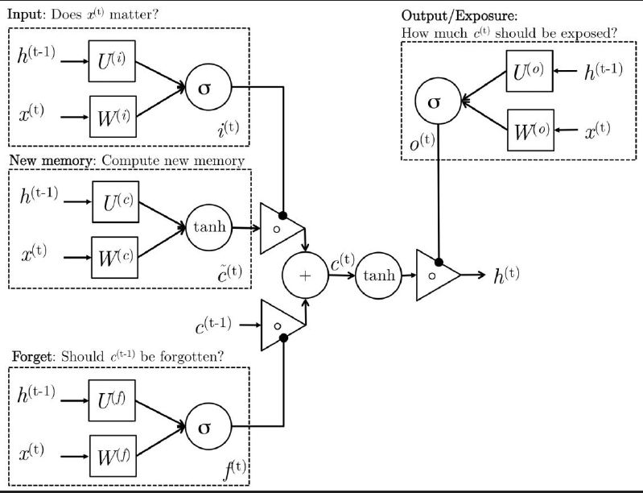

## RNN学习

### SRN(Simple Recurrent Networks)

早期的rnn由于结构简单，也被称为SRN。典型的有elman network和jordan network，在实践中，简单rnn无法很好的计算长时依赖。

#### Elman network

$$
h_t=\sigma_t(W_hx_t+U_hh_{t-1}+b_h)\\
y_t=\sigma_y(W_yh_t+b_y)
$$

#### Jordan network

$$
h_t=\sigma_t(W_hx_t+U_hy_{t-1}+b_h)\\
y_t=\sigma_y(W_yh_t+b_y)
$$

在上式中：$x_t$表示输入向量，$h_t$表示隐层向量，$y_t$是输出向量。$W,U$和$b$表示参数矩阵和向量。$\sigma_h$和$\sigma_y$为激活函数。

### LSTM

在1997年，就提出了lstm，相对于简单rnn，lstm更接近人类处理信息的方式，可以控制新输入的状态保留多少，先前隐层的状态遗忘多少。

$$
i^{(t)}=\sigma(W^{(i)}x^{(t)}+U^{(i)}h^{(t-1)}) \qquad (Input \ gate)\\
f^{(t)}=\sigma(W^{(f)}x^{(t)}+U^{(f)}h^{(t-1)})\qquad(Forget \ gate)\\
o^{(t)}=\sigma(W^{(o)}x^{(t)}+U^{(o)}h^{(t-1)})\qquad(Output/Exposure\ gate)\\
\tilde{c}^{(t)}=tanh(W^{(c)}x^{(t)}+U^{(c)}h^{(t-1)})\qquad(New\ memory\ cell)\\
c^{(t)}=f^{(t)}\circ\tilde{c}^{(t-1)}+i^{t}\circ\tilde{c}^{(t)}\qquad(Final\ memory\ cell)\\
h^{(t)}=o^{(t)}\circ tanh(c^{(t)})
$$

#### 遗忘门层

$$f^{(t)}=\sigma(W^{(f)}x^{(t)}+U^{(f)}h^{(t-1)})\qquad(Forget \ gate)\\$$

该门会读取 `h_{t-1}` 和 `x_t`，输出一个在 0 到 1 之间的数值给每个在细胞状态 `C_{t-1}` 中的数字。1 表示“完全保留”，0 表示“完全舍弃”。

让我们回到语言模型的例子中来基于已经看到的预测下一个词。在这个问题中，细胞状态可能包含当前**主语**的性别，因此正确的**代词**可以被选择出来。当我们看到新的**主语**，我们希望忘记旧的**主语**。